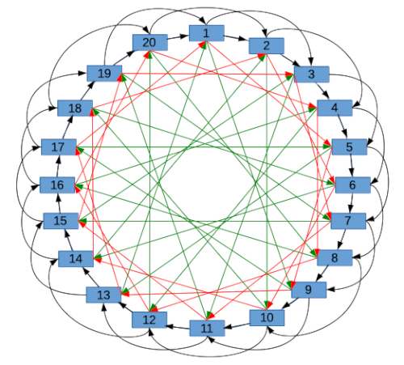

<pre>
  DIP: 0006
  Title: Long-Living Masternode Quorums
  Author(s):  Alexander Block
  Special-Thanks: Cofresi, Darren Tapp, Thephez, Samuel Westrich
  Comments-Summary: No comments yet.
  Status: Final
  Type: Standard
  Created: 2018-09-07
  License: MIT License
</pre>

## Table of Contents

1. [Abstract](#abstract)
1. [Motivation](#motivation)
1. [Prior Work](#prior-work)
1. [Supporting documents](#supporting-documents)
1. [Parameters/Variables of a LLMQ and DKG](#parametersvariables-of-a-llmq-and-dkg)
1. [Intra-Quorum Communication](#intra-quorum-communication)
    1. [Building the set of deterministic connections](#building-the-set-of-deterministic-connections)
    1. [Watch mode](#watch-mode)
1. [LLMQ DKG Network Protocol](#llmq-dkg-network-protocol)
    1. [Initialization phase](#1-initialization-phase)
    2. [Contribution phase](#2-contribution-phase)
    3. [Complaining phase](#3-complaining-phase)
    4. [Justification phase](#4-justification-phase)
    5. [Commitment phase](#5-commitment-phase)
    6. [Finalization phase](#6-finalization-phase)
    7. [Mining phase](#7-mining-phase)
1. [Active LLMQ sets](#active-llmq-sets)
1. [Current LLMQ types](#current-llmq-types)
1. [Copyright](#copyright)

## Abstract

This DIP defines Long Living Masternode Quorums (LLMQ). A LLMQ is a deterministic subset of the global deterministic masternode list. Such a quorum is formed with the help of a distributed key generation (DKG) protocol and is supposed to be active for a long time (e.g. days). Multiple quorums are kept alive at the same time, allowing load balancing between these quorums. The main task of a LLMQ is to perform threshold signing of consensus related messages.

## Motivation

Before the activation of Long Living Masternode Quorums as described in this document Masternode Quorums were already used in Dash for InstantSend and Masternode payment voting. These were however short living and very small (10 members). They were created per InstantSend input and required the network to fully propagate one vote per quorum member.

Those quorums did not scale very well, as complete propagation of all votes to the full network with larger quorums would have very likely overloaded the network. It was also not practical to store voting results on-chain, as too many signatures would have had to be stored in blocks.

New functionality and use cases required much larger quorums and also the storage of voting results on-chain.

Long Living Masternode Quorums and BLS M-of-N Threshold signatures provide a solution which reduces the network message quantity to 1 message per signing session (e.g. InstantSend input), regardless of the quorum size. Only the quorum itself has to keep track of all the messages which are part of a signing session. The quorum can then discard all intermediate messages (signature shares) after a final recovered threshold signature has been created and only this recovered threshold signature needs to be propagated network-wide.

## Prior work

* [Transaction Locking and masternode Consensus: A Mechanism for Mitigating Double Spending Attacks](https://github.com/dashpay/docs/blob/master/binary/Dash%20Whitepaper%20-%20Transaction%20Locking%20and%20Masternode%20Consensus.pdf)
* [DIP 002: Special Transactions](https://github.com/dashpay/dips/blob/master/dip-0002.md)
* [DIP 003: Deterministic Masternode Lists](https://github.com/dashpay/dips/blob/master/dip-0003.md)
* [Secure Distributed Key Generation for Discrete-Log Based Cryptosystems](https://pdfs.semanticscholar.org/bf9e/630c13f570e2df05b6dcce3ea987015af7c3.pdf)
* [DFINITY Consensus System](https://dfinity.org/pdf-viewer/pdfs/viewer?file=../library/dfinity-consensus.pdf)

## Supporting documents

LLMQs are highly dependent on the BLS Signature Scheme and more advanced BLS schemes. The following supporting documents describe these topics. It is advised to first read and understand these before continuing with this DIP.

* [BLS Signature Scheme](dip-0006/bls_signature_scheme.md)
* [BLS M-of-N Threshold Scheme and Distributed Key Generation](dip-0006/bls_m-of-n_threshold_scheme_and_dkg.md)

## Parameters/Variables of a LLMQ and DKG

The LLMQ’s DKG protocol and threshold signing details are controlled by a set of configuration parameters. The most notable parameters are the quorum size and the threshold size necessary to recover a valid threshold signature. The intention is to allow multiple types of LLMQs and DKGs to be active at the same time, as different use cases might require different performance and security characteristics.

We will refer to these parameters and variables multiple times in the following sections.

| Parameter | Description |
|--|--|
| quorumType | An unsigned 8 bit integer identifying the LLMQ type |
| quorumSize | The size of the quorum, e.g. 10, 200 or 400. This parameter has the highest influence on the performance of the DKG. A small DKG for a small LLMQ can be performed in a few seconds, while a large LLMQ can take more than a hour to complete. This is identical to the “n” in m-of-n. |
| quorumMinSize | Minimum number of valid members for quorum to be considered valid after the DKG has removed bad members. |
| quorumThreshold | The minimum number of threshold signature shares required to recover a threshold signature. It also influences the DKG as it is the minimum number of valid members to create a valid premature commitment and final commitment. This value should be at least 51% of the quorumSize. This is identical to the “m” in m-of-n. |
| quorumDkgInterval | The number of blocks between two DKG sessions. If set to 576 for example, a new DKG session will start once per day. |
| quorumDkgPhaseBlocks | Number of blocks a single DKG phase is active. It must be high enough to allow all members to exchange all required messages. It must also be high enough to take block time variances into account. |
| quorumDkgBadVotesThreshold | Threshold for votes on bad members. If >=badVotesThreshold members have voted on another member to be bad, that member is also considered bad locally. |
| quorumSigningActiveQuorumCount | Maximum number of LLMQs in the active LLMQs set |

List of variables per DKG session:

| DKG Session variable | Description |
|--|--|
| quorumBlock | The first block of a DKG session. |
| quorumHeight | The height of quorumBlock. Can be calculated with “curHeight - (curHeight % quorumDkgInterval)” |
| quorumHash | The hash of the quorumBlock and the identifier for the LLMQ which is built in the current DKG session. |

## Intra-Quorum Communication

The DKG and the signing sessions performed after LLMQ activation require many messages (up to one per phase and per member) to be propagated. Most of these messages are not of interest for nodes outside the LLMQ. Using full propagation (to all nodes) of all these messages would slow down the DKG and signing sessions dramatically. It would also impact the performance and stability of the whole network.

As a solution, we introduce the concept of “Intra-Quorum Communication”. Each LLMQ member is required to connect to a deterministically selected set of members and keep these connections open for the whole DKG and quorum lifetime. The way the required connections are determined ensures that there is always a path with low numbers of hops from each member to each other member. It also ensures that failure of individual members in the LLMQ does not result in total failure of the DKG and LLMQ.

When messages need to be propagated to all other members, the members will then only push inventory items and messages to this deterministic set of connections. The other members will perform the same, until the message is propagated to the whole LLMQ.

### Building the set of deterministic connections

Every member of the quorum has to build its own list of deterministic quorum connections. This is done the following way:

1. Build the deterministic list of quorum members (See Initialization Phase of the DKG protocol).
2. Loop through the list until the member finds itself in the list. The index at which it finds itself is called `i`.
3. Calculate indexes `(i+2^k)%n` where `k` is in the range `0..floor(log2(n-1))-1` and `n` is equal to the size of the list.
4. Add addresses of masternodes at indexes calculated at previous step to the set of deterministic connections.

The result can be imagined as a circle of nodes.

Most messaging between members is performed using the inventory system of Dash. This means that members will first send INV messages to other members and respond to GETDATA messages. Some communication messages, however, will be directly sent (see [DIP007 - LLMQ Signing Requests/Sessions](https://github.com/dashpay/dips/blob/master/dip-0007.md)) to quorum members without using the inventory system.

### Watch mode

Even though the DKG and signing messages are not important for other nodes, it must be possible for arbitrary nodes to watch the DKG and quorum communication. This is useful if someone wants to debug the DKG sessions and LLMQ signing sessions. It also increases the transparency in this trustless system, as it allows third parties to verify the correctness of DKG sessions.

To watch quorum communication, a node must connect to one or more arbitrary quorum members and send the “qwatch” message to these members. The members are then required to send all quorum-related messages to this node, even though it is not part of the deterministic connection set.

## LLMQ DKG Network Protocol

The DKG Network protocol is based on the DKG Protocol described in BLS M-of-N Threshold Scheme and Distributed Key Generation. The linked document only describes the mathematical basics of Shamir’s Secret Sharing and the DKG. This section extends the basics by adding the required network protocol details.

A new LLMQ is built periodically in a fixed interval (quorumDkgInterval). The interval is measured in number of blocks. After a LLMQ has been successfully built, it is committed/mined on-chain. The new LLMQ only becomes active and starts to do the actual work (threshold signing) after the block is processed.

Building a LLMQ consists of 7 phases:

1. Initialization
2. Contribution
3. Complaining
4. Justification
5. Commitment
6. Finalization
7. Mining

Each phase lasts for multiple blocks (quorumDkgPhaseBlocks) to ensure that all members are able to send, receive, verify and relay all messages belonging to a phase.

### 1. Initialization phase

In this phase, the members of the new quorum are determined. This process is fully deterministic and results in exactly the same list seen by all members and observers.

1. Retrieve the deterministic masternode list which is valid at quorumHeight
2. Calculate `SHA256(SHA256(proTxHash, confirmedHash), SHA256(SHA256(llmqType, quorumHash)))` for each entry in the list
    * The `confirmedHash` is the block hash when a masternode registration is considered fully confirmed. For mainnet, this is the block where the masternode registration transaction has 15 confirmations. For other networks, only 1 confirmation is required. **_Note_**: The `confirmedHash` block must have one confirmation itself before `confirmedHash` can be used.
3. Sort the resulting list by the calculated hashes
4. Take the first quorumSize entries from this list and use the corresponding masternodes as members list
5. Check if our masternode is part of this list. If not, we stop participating in the DKG.

Note: This process is modified for [Deterministic InstantSend](dip-0022.md) quorums which use the quorum rotation design specified in [DIP24](dip-0024.md).

After the members list is built, the LLMQ members start to initiate the connections to the deterministic set of quorum connections as described in the “Intra-Quorum Communication” section.

### 2. Contribution phase

Each member of the LLMQ will generate its own contribution to the DKG and then relay it. At the same time, each member will receive the contributions of all other members and verify the individual contributions.

A contribution consists of a “verification vector” and an individual secret key contribution for all members (including for itself). The verification vector is meant to be public and can be seen by all other members. It resembles the public P(x) polynomial described in the BLS M-of-N Threshold Scheme.

The secret key contributions are meant to be private and must only be visible by the members for which they were generated. The secret key contributions are the result of the evaluation of the private S(x) polynomial.

To make the secret key contributions private, each secret key contribution is encrypted using an Integrated Encryption Scheme (BLS-Diffie-Hellman + AES256 + CBC). The recipient key is the BLS public operator key of the targeted masternode.

The whole contribution (verification vector + secret key contributions) results in a single message which must be relayed/propagated to all other members. The format of the message is described at the bottom of this section.

Each receiver of a contribution message must first perform some basic validation of the message on receival. These include:

1. The quorumHash must match the current DKG session
2. The proTxHash must belong to a member of the LLMQ
3. The verification vector must have exactly as many entries as the configured quorumThreshold
4. The verification vector should not have any duplicates
5. The number of secret key contributions must match the total quorum size
6. The signature of the message must be valid and signed with the operator key of the contributing masternode

If the basic verification succeeds, the message must be relayed to all other members, even if further verification of the secret key contribution fails.

After relaying, the receiving member should try to decrypt and verify the secret key contribution which belongs to itself. If this fails, the contributing member must be marked for later complaining. To verify a secret key contribution, the receiver must use the verification vector of the contributor as the public polynomial P(x) and evaluate it with its own BLS id (the proTxHash). The resulting public key must match the public key calculated from the secret key contribution.

The reason these messages must be relayed independently from secret key verification is that only one member in the quorum is able to perform verification on an individual secret key contribution. A dishonest member might only lie to a single member and still be honest to other members. Without relaying such messages, individual members of the quorum might end up not receiving their honest contribution. Dishonest members are later handled in the complaining and justification phases.

If a member sends multiple contribution messages, they must be marked as bad immediately. In this case only up to 2 messages should be relayed to the rest of the quorum. It doesn’t matter which ones are relayed since this is only done to ensure that all members see the bad behavior.

The internal Dash message name is `qcontrib` and the format of the message is:

| Field | Type | Size | Description |
|--|--|--|--|
| llmqType | uint8_t | 1 | The LLMQ type
| quorumHash | uint256 | 32 | The quorum identifier
| proTxHash | uint256 | 32 | The proTxHash of the contributing member
| vvecSize | compactSize uint | 1-9 | The size of the verification vector
| vvec | BLSPubKey[] | 48 * vvecSize | The verification vector
| ephemeralPubKey | BLSPubKey | 48 | Ephemeral BLS public key used to encrypt secret key contributions
| ivSeed | uint256 | 32 | Seed used to create the AES initialization vectors for all members
| skCount | compactSize uint | 1-9 | Number of encrypted secret key contributions
| skContributions | byte[] | 32 * skCount | Secret key contributions encrypted to recipient masternodes’ BLS public operator key
| sig | BLSSig | 96 | BLS signature, signed with the operator key of the contributing masternode

### 3. Complaining phase

In the previous phase, members have to keep track of other members which sent invalid secret key contributions. In the complaining phase, a complaint message is created based on this information and relayed to the other members of the LLMQ. The format of this message is described at the bottom of this section.

Each receiver of a complaint message must first perform some validation of the message received. This includes:

1. The quorumHash must match the current DKG session
2. The proTxHash must belong to a member of the LLMQ
3. The byte size of the bad members and complaints bitvectors must match `(quorumSize + 7) / 8`
4. No out-of-range bits should be set in byte representation of the bad members and complaints bitvectors
5. The signature of the message must be valid and signed with the operator key of the contributing masternode

If verification succeeds, the message must be relayed to all other members.

Each set bit in the bad members bitvector represents another member for which no valid contribution message was received by the complainer. The index of a set bit is also the index into the members list. This information is meant to be a vote and is not trusted on its own. Only if enough (>=badVotesThreshold) complainers marked another member as bad, the member is locally marked as bad. This is intended to catch late-comers who sent their contribution on the brink of a phase transition (Contribution->Complaint). Otherwise the DKG might end up being split and each member having a different view on the state.

Each set bit in the complaints bitvector represents another member which the sender of the complaint message is complaining about. The index of a set bit is also the index into the members list.

The receiver must take note of all complaints and later verify that the members which were complained about do a honest justification.

It’s theoretically possible that a member is lying about another member and thus complains even though the other member was honest. In that case the quorum can not know who is lying and who is honest, and thus must handle both cases identically (expect a justification).

The receiver must also check if a complaint against itself has been sent. In this case it must note this and later send a justification, even if all contributions previously sent were honest.

If this phase is reached and another member did not send any contribution message, that member is immediately marked as bad and not considered for further justification. This is because only the initial contribution message contains the verification vector necessary to do further verification and finalization. It is not intended to give members a second chance to publish a verification vector, as this would result in inconsistent views on the DKG state.

If a member sends multiple complaint messages, it must be marked as bad immediately. In this case only up to 2 messages should be relayed to the rest of the quorum. It doesn’t matter which ones are relayed since this is only done to ensure that all members see the bad behavior.

The internal Dash message name is `qcomplaint` and the format of the message is:

| Field | Type | Size | Description |
|--|--|--|--|
| llmqType | uint8_t | 1 | The LLMQ type
| quorumHash | uint256 | 32 | The quorum identifier
| proTxHash | uint256 | 32 | The proTxHash of the complaining member
| badBitSize | compactSize uint | 1-9 | Number of bits in the bad members bitvector
| badMembers | byte[] | (badBitSize + 7) / 8 | The bad members bitvector
| complaintsBitSize | compactSize uint | 1-9 | Number of bits in the complaints bitvector
| complaints | byte[] | (complaintsBitSize + 7) / 8 | The complaints bitvector
| sig | BLSSig | 96 | BLS signature, signed with the operator key of the contributing masternode

### 4. Justification phase

In this phase, each member that was previously complained about must justify for a valid contribution. Justification is only allowed for members who sent a contribution and is not allowed for members previously marked as bad.

Justification means that a member has to reveal the secret key contribution that it had initially encrypted and sent to the complainer. This way all other members can verify if the secret key contribution is valid. If the secret key contribution is invalid, the justifier is immediately marked as bad. If the secret key contribution is valid, the complained state for the specific complainer is removed from the justifier. Verification of the published secret key contribution is the same as in the contribution phase, with the difference that the BLS id used in the polynomial evaluation is the one of the justifier instead of the one of the verifier. If verification fails, the justifying member must be marked as bad.

Revealing individual secret key contributions is not a security risk, as long as not all secret key contributions of a single member are revealed. If this happens, it is identical to revealing a single aggregated secret key contribution of a single member. For this to happen, all members would have to complain about the same member, which is unlikely to happen (assuming the member is honest).

Each receiver of a justification message must first perform some validation of the message on receival. This includes:

1. The quorumHash must match the current DKG session
2. The proTxHash must belong to a member of the LLMQ
3. The size of the skContributions vector must not exceed the quorum size
4. Each entry in skContributionMembers must be in the bounds of quorumSize
5. No duplicate entries in skContributionMembers
6. No duplicate entries in skContributions
7. The signature of the message must be valid and signed with the operator key of the contributing masternode

If verification succeeds, the message must be relayed to all other members.

If a member sends multiple justification messages, it must be marked as bad immediately. In this case only up to 2 messages should be relayed to the rest of the quorum. It doesn’t matter which ones are relayed since this is only done to ensure that all members see the bad behavior.

The internal Dash message name is `qjustify` and the format of the message is:

| Field | Type | Size | Description |
|--|--|--|--|
| llmqType | uint8_t | 1 | The LLMQ type
| quorumHash | uint256 | 32 | The quorum identifier
| proTxHash | uint256 | 32 | The proTxHash of the justifying member
| skCount | compactSize uint | 1-9 | Number of unencrypted secret key contributions
| skContributions | pair(uint32[], BLSSecKey[]) | (4 + 32) * skCount |  Unencrypted secret key contributions with indexes of the corresponding members
| sig | BLSSig | 96 | BLS signature, signed with the operator key of the contributing masternode

### 5. Commitment phase

In this phase, each member must collect all contributions from all members not marked as bad. The members then build the final quorum verification vector from the individual verification vectors of the members. The members also create their own threshold secret key share from the secret key contributions received by all valid members.

The quorum verification vector is calculated by aggregating all valid member’s verification vectors into a single verification vector. The quorum verification vector is equal to the aggregated public polynomial Pa(x) described in the BLS M-of-N Threshold Scheme. The secret key share is the aggregation of all valid member’s secret key contributions. The quorum public key is the first element (the free coefficient) of the quorum verification vector.

The member must then create a premature commitment message which contains the quorum public key, the hash of the quorum verification vector and a bitset of the valid members.

The message is not signed as usual, but instead a commitment hash is created and then signed twice, once with the members operator key and once with the calculated threshold secret key share. The commitment hash is `SHA256(quorumHash, validMembers, quorumPublicKey, quorumVvecHash)`.

The operator signature allows other members to verify that the message originated from this member. The threshold signature allows other members to verify that the commitment is valid and that the member successfully calculated his secret key share. Both signatures later also allow to aggregate multiple premature commitments into a final commitment.

Each receiver of a premature commitment message must first perform some basic validation of the message. These include:

1. The quorumHash must match the current DKG session
2. The proTxHash must belong to a member of the LLMQ
3. The byte size of the validMembers bitvector must match `(quorumSize + 7) / 8`
4. No out-of-range bits should be set in the byte representation of of the validMembers bitvector
5. The number of set bits in the validMembers bitvector must be at least >= quorumThreshold
6. The sig must validate against the commitmentHash and the committing member’s operator key

If verification succeeds, the message must be relayed to all other members.

After relaying, further verification must be performed:

1. The quorumPublicKey must match the quorum public key calculated by the verifying member, based on the contributions of the members marked as valid in validMembers
2. The quorumVvecHash must match the hash of the quorum verification vector calculated by the verifying member, based on the contributions of the members marked as valid in validMembers
3. The quorumSig must validate against the commitmentHash and the committing members threshold public key share, which must be calculated before. The public key share is calculated by evaluating the quorum verification vector as a polynomial Pa(x) with x being the signing members BLS id (proTxHash).

If this verification succeeds, the premature commitment must be added to the set of commitments which are later taken into consideration for final commitments. If this verification fails, the premature commitment must be ignored for final commitments.

The reason why premature commitments must be relayed even if further verification fails is that it might be unclear if the validating member is the one missing crucial information or if the other member is dishonest. If the majority (>= quorumThreshold) of the quorum determines that the premature commitment is valid, it is very likely that the validating member is the one missing crucial information. If the other member is dishonest, all other members will come to the same conclusion and later ignore the premature commitment when final commitment happens.

The internal Dash message name is `qpcommit` and the format of the message is:

| Field | Type | Size | Description |
|--|--|--|--|
| llmqType | uint8_t | 1 | The LLMQ type
| quorumHash | uint256 | 32 | The quorum identifier
| proTxHash | uint256 | 32 | The proTxHash of the committing member
| validMembersSize | compactSize uint | 1-9 | Bit size of the validMembers bitvector
| validMembers | byte[] | (validMembersSize + 7) / 8 | Bitset of valid members in this commitment
| quorumPublicKey | BLSPubKey | 48 | The quorum public key
| quorumVvecHash | uint256 | 32 | The SHA256 hash of the quorum verification vector
| quorumSig | BLSSig | 96 | Threshold signature, signed with the threshold signature share of the committing member
| sig | BLSSig | 96 | BLS signature, signed with the operator key of the contributing masternode

### 6. Finalization phase

In this phase, all members of the quorum will collect all locally valid premature commitments and build final commitments from these. Only premature commitments with the same set of valid members, the same quorum public key and the same quorum verification vector hash can be aggregated into a single final commitment. Also, a final commitment can only be created if at least quorumThreshold valid premature commitments are present.

To aggregate multiple premature commitments into a single final commitment, the following must be performed:

1. Take all premature commitments for the same set of valid members, quorum public key and quorum verification vector hash.
2. If the number of collected premature commitments is less then the quorumThreshold, skip this set of premature commitments and try another one.
3. Create a final commitment and set the quorumHash, quorumPublicKey and quorumVvecHash to the values determined in 1.
4. Build a bitset of size quorumSize and set all bits for all members of the collected premature commitments
5. Set the signersSize and signers field of the final commitment to this bitset.
6. Perform a BLS signature aggregation for all operator signatures found in the premature commitments. Set the sig field of the final commitment to the result of the aggregation.
7. Perform a BLS threshold signature recovery based on the quorumSigs of the premature commitments. Set the quorumSig field of the final commitment to the result of the recovery.

The resulting final commitment must then be relayed to ALL full nodes of the network, including non-masternodes and masternodes which are not members of this quorum. It should not be relayed to SPV nodes. The message contains all the necessary information required to validate all upcoming quorum signing results. The message is also later used by miners (thus, full propagation is required) to mine it on-chain, which finally activates the quorum.

Each receiver (which might be non-members) of a final commitment message must first perform some basic validation of the message when it is received. These include:

1. The quorumHash must match the current DKG session
2. The byte size of the signers and validMembers bitvectors must match “(quorumSize + 7) / 8”
3. No out-of-range bits should be set in byte representation of the signers and validMembers bitvectors
4. The number of set bits in the signers and validMembers bitvectors must be at least >= quorumThreshold
5. The quorumSig must validate against the quorumPublicKey and the commitmentHash. As this is a recovered threshold signature, normal signature verification can be performed, without the need of the full quorum verification vector. The commitmentHash is calculated in the same way as in the commitment phase.
6. The sig must validate against the commitmentHash and all public keys determined by the signers bitvector. This is an aggregated BLS signature verification.

It is important to note that in this phase, we can not perform full verification of the quorum verification vector. This is because all nodes (including non-members) must come to the same conclusion. This is still secure, as final commitments are only valid if at least quorumThreshold members have signed the same commitmentHash.

If verification succeeds, the final commitment must be added to the set of minable final commitments.

It is possible and valid if multiple final commitments are propagated for the same DKG session. These should however only differ in the number of signers, which can be ignored as long as there are at least quorumThreshold signers. The set of valid members for these final commitments should however always be the same, as all members only create a single premature commitment. This means, that only one set of valid members, and thus only one quorum verification vector and quorum public key can gain a majority. If the threshold is not reached, there will be no valid final commitment.

The internal Dash message name is `qfcommit` and the format of the message is:

| Field | Type | Size | Description |
|--|--|--|--|
| version | uint16_t | 2 | Version of the final commitment message
| llmqType | uint8_t | 1 | [Type of LLMQ](#current-llmq-types)
| quorumHash | uint256 | 32 | The quorum identifier
| signersSize | compactSize uint | 1-9 | Bit size of the signers bitvector
| signers | byte[] | (signersSize + 7) / 8 | Bitset representing the aggregated signers of this final commitment
| validMembersSize | compactSize uint | 1-9 | Bit size of the validMembers bitvector
| validMembers | byte[] | (validMembersSize + 7) / 8 | Bitset of valid members in this commitment
| quorumPublicKey | BLSPubKey | 48 | The quorum public key
| quorumVvecHash | uint256 | 32 | The SHA256 hash of the quorum verification vector
| quorumSig | BLSSig | 96 | Recovered threshold signature
| sig | BLSSig | 96 | Aggregated BLS signatures from all included commitments

Starting with version >= 2, the `quorumIndex` field highlighted below is included as described in [DIP24](dip-0024-rotation.md#quorum-composition):

| Field | Type | Size | Description |
|--|--|--|--|
| version | uint16_t | 2 | Version of the final commitment message
| llmqType | uint8_t | 1 | [Type of LLMQ](#current-llmq-types)
| quorumHash | uint256 | 32 | The quorum identifier
| **quorumIndex** | **int16_t** | **2** | **The quorum index** |
| signersSize | compactSize uint | 1-9 | Bit size of the signers bitvector
| signers | byte[] | (signersSize + 7) / 8 | Bitset representing the aggregated signers of this final commitment
| validMembersSize | compactSize uint | 1-9 | Bit size of the validMembers bitvector
| validMembers | byte[] | (validMembersSize + 7) / 8 | Bitset of valid members in this commitment
| quorumPublicKey | BLSPubKey | 48 | The quorum public key
| quorumVvecHash | uint256 | 32 | The SHA256 hash of the quorum verification vector
| quorumSig | BLSSig | 96 | Recovered threshold signature
| sig | BLSSig | 96 | Aggregated BLS signatures from all included commitments

### 7. Mining phase

After final commitments have been propagated in the network, miners should take the best final commitment for a DKG session and mine it into the next block. The best final commitment is simply the one with the most signers.

A final commitment is mined in the payload of a new special transaction (DIP2). The special transaction is called “quorum commitment” and uses type=6. This special transaction has no inputs and no outputs and thus also pays no fee. This requires lifting consensus rules to allow no-input/no-output transactions for this special transaction.

As this special transaction pays no fees, miners generally don’t have an incentive to include the transaction into a new block. To solve this, we make the special transaction mandatory by consensus rules, meaning that exactly one quorum commitment transaction MUST be included in every block while in the mining phase and until a valid commitment is present in a block.

If a DKG failed or a miner did not receive a final commitment in-time, a null commitment has to be included in the special transaction payload. A null commitment must have the signers and validMembers bitsets set to the quorumSize and all bits set to zero. All other fields must be set to the null representation of the field’s types.

With these new consensus rules, the incentives for miners are turned around. Instead of requiring an incentive to include it in a block, we remove the incentive to leave it out. Whatever the miner decides, the space required for the commitment is always used. If a miner still decides to be dishonest, other honest miners will include the special transaction in one of the next blocks.

These consensus rules are only applied while the DKG is in the mining phase. After a block is mined that includes a final commitment, the consensus rules are not applied anymore (even if still in the mining phase). This ensures that not too much space is wasted.

Every node, that receives a block, must verify that these consensus rules are followed. This means:

1. If the "height" field of the special transaction payload does not match the height of the block in which it the payload is included, the block should be rejected. This ensures that all commitment special transactions have a unique hash, including null commitments.
2. If the DKG is not in the mining phase and the new block contains a (null or non-null) commitment, the block should be rejected.
3. If no final commitment was mined for the current DKG yet and the new block does not include a (possibly null) commitment, the block should be rejected.
4. If in the current mining phase a previous block already mined a non-null commitment and the new block contains another (null or non-null) commitment, the block should be rejected.
5. If the block contains more than one commitment, the block should be rejected.
6. If the commitment inside the special transaction payload is not valid (see validation rules of the "qfcommit" P2P message), the block should be rejected.

After a block with a valid (non-null) commitment has been accepted and processed, the quorum belonging to the commitment must be added to the active quorums set. From this point on, the quorum is able to perform threshold signing of arbitrary messages and all nodes in the network are able to verify the result (recovered signature) of such signing sessions.

The format of the "quorum commitment" special TX payload with type=6 is:

| Field | Type | Size | Description |
|--|--|--|--|
| version | uint_16 | 2 | Commitment special transaction version number.  Currently set to 1. Please note that this is not the same as the version field of qfcommit |
| height | uint32_t | 4 | The height of the block in which this commitment is included
| commitment | qfcommit | Variable | This equals the payload of the "qfcommit" P2P message

## Active LLMQ sets

After a DKG finishes and the final commitment has been mined, a LLMQ becomes active and can start participating in signing requests/sessions.

The set of currently active LLMQs is a limited list with a maximum size of "quorumSigningActiveQuorumCount". When the active
set reaches the maximum size, the oldest entry is removed each time a new LLMQ becomes active.

A merkle root of all active LLMQ sets is calculated and included into [DIP4 CbTx](https://github.com/dashpay/dips/blob/master/dip-0004.md) with version >= 2.

## Signing sessions/requests

The details of the signing process are handled in [DIP007](https://github.com/dashpay/dips/blob/master/dip-0007.md). The individual use cases for LLMQs are handled in specialized DIPs.

## Current LLMQ types

LLMQ types may be defined based on future DIPs. A list of registered LLMQ types can be found [here](dip-0006/llmq-types.md).

## Copyright

Copyright (c) 2018 Dash Core Group, Inc. [Licensed under the MIT License](https://opensource.org/licenses/MIT)
