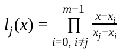
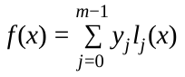
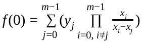

# BLS M-of-N Threshold Scheme and Distributed Key Generation

<pre>
  Title: BLS M-of-N Threshold Scheme and Distributed Key Generation
  Author(s):  Alexander Block
  Special-Thanks: Cofresi, Darren Tapp, Thephez, Samuel Westrich
  Comments-Summary: No comments yet.
  Type: Supporting Document
  Created: 2018-09-07
  License: MIT License
</pre>

## Abstract

This supporting document introduces a BLS based M-of-N threshold scheme. First, a simple M-of-N threshold scheme based on [Shamir’s Secret Sharing](https://en.wikipedia.org/wiki/Shamir%27s_Secret_Sharing) is introduced. As the simple scheme requires a trusted dealer of key shares, it is unsuitable in a decentralized network. A more advanced, trustless and decentralized scheme is then introduced which removes the need for a single trusted dealer. Finally, a distributed key generation (DKG) protocol is introduced which leverages all this.

## Prior work

 - [BLS Signature Scheme](bls_signature_scheme.md)
 - [Secure Distributed Key Generation for Discrete-Log Based Cryptosystems](https://pdfs.semanticscholar.org/bf9e/630c13f570e2df05b6dcce3ea987015af7c3.pdf)

## Shamir’s Secret Sharing

[Shamir’s Secret Sharing](https://en.wikipedia.org/wiki/Shamir%27s_Secret_Sharing) is a known M-of-N threshold scheme that has proven to be secure if done correctly. It allows splitting a secret into a set of secret shares. A secret share does not leak any information about the original secret and thus is useless on its own. Recovery of the original secret is only possible if enough shares (m-of-n) are gathered. If someone only knows m-1 shares, he is as clueless as someone having no shares at all. The secret can be anything that is representable by a (possibly very large) number, including arbitrary binary or text data. With BLS, the secret is typically the secret key, but indirectly also the public key and signatures.

Shamir’s Secret Sharing is based on polynomial evaluation and interpolation. Evaluation of the polynomials is used to create the shares and Lagrange interpolation is used to recover the original secret from m-of-n gathered secret shares. With BLS it is possible to use different types of polynomials where the results of evaluation and interpolation correspond to the other polynomials when built from the corresponding primitives.

### Polynomials in Shamir’s Secret Sharing

Polynomials in Shamir’s Secret Sharing are generally of the following form:

_f(x) =a0 + a1x1 + a2x2 + a3x3 + ... + am-1xm-1_

The symbols _a0-am-1..._ are the coefficients of the polynomial. The first coefficient _a0_ is also called the free coefficient and is always the value to be shared. The remaining coefficients are either randomly chosen values or derived from another polynomial (see descriptions of individual polynomial types).

The degree of the polynomials is always equal to M-1, meaning that the number of coefficients is always M (as it includes the free coefficient). As the form of the polynomial is always the same, it can be represented by a vector of coefficients [_a0, a1, a2, a3, ... ,am-1_]

In the schemes described in this document, the coefficients are all either BLS secret keys, BLS public keys or BLS signatures.

_x_ is the parameter to the polynomial used when evaluating it. It is generally a value that identifies the receiver of a share and can for example be a simple (1-based) index or a hash. We will also refer to _x_ as being the “id” or “BLS Id”. Please note that _f(0)_ always evaluates to the same value as the free coefficient and thus the shared value.

### Recovery of _f(x)_ with Lagrange Interpolation

The result of the evaluation of _f(x)_ gives the _y_ coordinate of a point on the polynomial. This means, that _(x, y = f(x))_ defines a single point on the polynomial. To reconstruct the original polynomial of degree M-1, only M points on the polynomial are required if lagrange interpolation is used.

Given M shares, represented as points

_(x0, y0), (x1, y1), ..., (xm-1, ym-1)_

we can build M Lagrange base polynomials of the following form

Using these Lagrange base polynomials, we can reconstruct f(x)

As we are only interested in the result of _f(0)_, which is identical to the free coefficient of f(x) and thus the shared value which we want to recover, the calculation can be reduced to

### Secret Polynomial: _S(x)_

In the basic form of Shamir’s Secret Sharing, a single polynomial _S(x)_ of degree m-1 is created. The free coefficient in this polynomial is the original secret key while the remaining m-1 coefficients are some randomly generated secret keys.

Evaluating this polynomial for each member gives the secret key share for each member. If anyone knows m of these secret shares, Lagrange interpolation can be used to recover the original secret key. If less than m secret shares are known, recovery is not possible. Due to the properties (correlation, uniqueness and determinism) of BLS, the recovered secret key will always be the same, independent from which M shares out of N were used.

The secret polynomial _S(x)_ should never be shared in public. Whoever knows _S(x)_, is able to calculate all secret key shares. Even worse, as the free coefficient is identical to the actual secret, the secret itself would be leaked.

### Public Polynomial: _P(x)_

With BLS, it is also possible to create a polynomial _P(x)_ of the same degree as _S(x)_ with all coefficients set to the corresponding public keys of _S(x)_. Evaluation of _P(x)_ gives the public keys which correspond to the secret key shares created from _S(x)_. This works due to the properties (correlation) of BLS primitives, where the same operations performed on two corresponding BLS primitives (e.g. secret and public key) will result in a new tuple of corresponding BLS primitives.

This polynomial _P(x)_ can be publicly shared and does not leak any information about the secret key. It can be used to verify that a received secret key share is actually the result of the evaluation of the polynomial _S(x)_ without knowing the polynomial. This is done by evaluating the polynomial _P(x)_ with x being the id of the sending member. The secret key share is only considered valid if the result is equal to the public key calculated from the received secret key share.

As previously described, the free coefficient of _S(x)_ is the original secret key, which also means that the free coefficient of _P(x)_ is the public key that corresponds to the original secret key. Due to the properties of BLS (correlation), this also means that a signature recovered later can be verified against this public key.

The coefficients of _P(x)_ are also called the verification vector, which we’ll refer to when describing the distributed key generation protocol.

### Signature Polynomial: _SigP(x)_

This polynomial is actually never created and only exists in theory. It consists of the signatures which would be created if the coefficients of _S(x)_ were used to sign the same message. If this polynomial existed, evaluation of it would result in the signature shares. These signature shares would be identical to the signature shares created with the result (secret key shares) of the evaluation of _S(x)_.

Even though this polynomial is never created, the known correlation between the secret key shares and the signature shares can be used to recover a final signature by performing Lagrange interpolation on m-of-n signature shares. The resulting recovered signature validates against the free coefficient of _P(x)_. This also means, that the recovered signature is identical to the signature that would be created if the free coefficient (the original secret key) of _S(x)_ were used to sign the same message.

### (Lack of) Trust in Shamir’s Secret Sharing

The BLS-based Shamir’s Secret Sharing Scheme described above has a serious disadvantage when used on its own. It requires a central dealer which creates the original secret key and distributes the secret key shares and the verification vector (public polynomial) to all other members. Each member is able to verify correctness of the received secret key share by using the verification vector, but this does not protect against compromised dealers. The biggest risk with a central dealer is the risk of leaked keys, which would not be acceptable in a decentralized and trustless network.

## Aggregated Shamir’s Secret Sharing

The solution to the above problem is to use an aggregated form of Shamir’s Secret Sharing.

### Correlation and aggregation of polynomials

As each described polynomial type correlates to the other polynomial types, it also means that if two different polynomials of the same type are aggregated, the resulting polynomial also correlates to the aggregated polynomials of the other polynomial types. For example, if _S0(x)_ and _S1(x)_ are aggregated, the resulting polynomial _Sa(x)_ correlates to _Pa(x)_, which is the aggregation of the corresponding _P0(x)_ and _P1(x)_ polynomials.

It also means that the aggregation of the individual secret shares created from _S0(x)_ and _S1(x)_ with the same _x_ value would correlate to the evaluated public key shares of the aggregated _Pa(x)_ with the same _x_ value.

Aggregation of two polynomials is performed by aggregating the individual coefficients of two polynomials. For example, given two polynomials represented by the coefficient vectors [a0, a1, a2] and [b0, b1, b2], the aggregated coefficients vector would be [a0+b0, a1+b1, a2+b2].

### Removing the central dealer

With the previously described properties, it is possible to remove the central dealer and instead turn every member of a threshold group into a dealer. Instead of trusting the individual dealers, the results from the individual dealers are aggregated into a single result. This in turn removes the ability of the dealers to control the outcome. It also removes the risk of leaked secrets, as leaking the secrets of individual members/dealers does not allow recovery of the actual secret.

Each dealer will create a secret key share (the contribution) from its own secret polynomial _S(x)_ for every member and share it secretly with the other individual members. Each dealer will also publicly share the public polynomial _P(x)_. After a member has received the shares from all other members, it can aggregate the shares into a new secret share.

The resulting secret share is identical to the evaluation of _Sa(x)_, which is the aggregation of all members _S(x)_. However, as the polynomials _S(x)_ are never publicly shared, no one will ever know _Sa(x)_ and thus will not be able to calculate the shares of other members.

Since each member’s public polynomial _P(x)_ is publicly known, _Pa(x)_ can be created by simply aggregating them. _Pa(x)_ can then be used to verify that the locally aggregated secret share is valid, simply by comparing the evaluation of _Pa(x)_ with the public key calculated from the aggregated secret key share.

The aggregated secret key shares can then be used to sign messages and thus create signature shares. The resulting signature shares can be verified with the result of the evaluation of _Pa(x)_, where x is the id of the signing member.

If enough signature shares are collected, Lagrange interpolation can be used to recover a final signature. Due to the properties of BLS (correlation), this signature will validate against the free coefficient of _Pa(x)_, which is the threshold group’s public key and corresponds to the free coefficient of the unknown polynomial _Sa(x)_.

## Distributed Key Generation (DKG) Protocol

The previously described scheme assumes that every member of the threshold group is honest. However, this can’t be a assumed in a decentralized and trustless network. Individual members can lie to other members or completely omit contributions. This can happen due to bugs, network problems, members being offline or malicious intents.

The solution to this is to use a Distributed Key Generation (DKG) Protocol. The protocol consists of multiple phases with messages being exchanged in each phase.

Even though the described protocol is a network protocol, we will not describe the internals of network messages and communication in this document. This is described in a specialized DIP.

The protocol consists of the following phases.

### Initialization

A few things must be verified before the actual DKG session can start. All the parameters of the DKG, for example M and N, must be agreed on. The members of the DKG session must also be deterministic, meaning that all members must use the same members list. Also, each member must have a publicly known and verified unique ID and a publicly known and verified public key usable for signing of individual messages and encryption of contributions.

### Contribution

Every member creates his own secret polynomial _S(x)_ and derives the public polynomial _P(x)_ from it. The public polynomial (verification vector) is published to all other members. The secret polynomial _S(x)_ is used to create a secret key share (the secret key contribution) for every threshold group member. These secret key contributions are then encrypted for each individual corresponding threshold group member and distributed to those members.

While generating the contributions, each member must also create a contribution for themselves.

### Complaining

After the contribution phase has finished, each member should have received one verification vector and one encrypted secret key contribution from each member. Each member should then verify all received secret key contributions by evaluating the public polynomial _P(x)_ and comparing the result with the calculated public key of the received secret key contribution.

If encryption or verification fails, the corresponding member has to be complained about. This is done by publishing a message to all other members which indicates the complaint.

The reason it is necessary to complain about members is that only a single member in the threshold group is able to verify an individual secret key contribution. This is because the contributions are encrypted individually for each member. If a member receives an invalid contribution, it must signal this to all other members, as otherwise the other members would not notice the misbehaviour.

If a member did not send any contribution at all, it must be marked as bad and is thus not considered as a valid member anymore.

### Justification

After the complaining phase has finished, each member should check if another member has complained about it. In this case, the member must publish a justification. The justification contains the unencrypted secret key contribution that was initially sent to the complaining member.

Publishing unencrypted secret key contributions here does not introduce new security risks. To understand this, we must look at the three possible scenarios:

1.  Individual members get complained about. In this scenario, the revealed secret key contributions are not useful on their own, as the final secret key share is the aggregation of all contributions.
2.  Every member complains about a single member. In this scenario, the member that is complained about will reveal all secret key contributions he generated for every other member. These secret key contributions are not useful as long as not all other contributions are revealed. This is because the final secret key share is the aggregation of all these secret key contributions.
3.  A single member complains about all other members. In this scenario, all members will reveal the secret key contributions for this single member. These contributions can theoretically be used to calculate the final secret key share of the member. However, if a member plans to reveal his final secret key share, it’s more effective to just reveal it after the commitment phase. Also, a single publicly known secret key share is useless on its own as there are m-of-n secret key shares required to create a recovered signature.

### Commitment

After the justification phase has finished, each member should first check if all complaints have been resolved by valid justifications. This is done by performing the same verification as in the contribution phase, but with the unencrypted contributions of the justifying members. If a complaint has not been resolved, the member that was complained about must be marked as bad and is thus not considered as a valid member anymore.

All verification vectors of all valid members must then be aggregated into a single verification vector. This is the threshold group’s public verification vector and the free coefficient is the threshold group’s public key.

Also, all secret key contributions of all valid members must be aggregated into a single secret key share. This is the member’s final secret key share and later used to threshold sign messages.

Based on the threshold group’s verification vector, the threshold group’s public key and the list of valid members, a premature commitment message must be created and published. The premature commitment message is basically a vote for the DKG’s result and only if enough members (e.g. at least M)  created the same commitment, a final commitment can be created.

The premature commitment is signed twice, once with the secret key corresponding to the public key of the member (already known prior to the DKG session), and once with the calculated secret key share.

### Finalization

After the commitment phase has finished, each member should collect all valid commitments from all members. Each commitment where the set of valid members, verification vector and public key is identical, should be grouped together. If a group with enough commitments (e.g. at least M) is found, a final commitment must be created from the group of premature commitments.

As previously noted, premature commitments are signed twice. While creating the final commitment, both signature types need to be combined in a different way. The first signature (the one signed with the secret key corresponding to the previously known public key) is aggregated to create the first signature for the final commitment. The second signature from all premature commitments is used to perform a threshold signature recovery. The resulting recovered signature is the second signature for the final commitment.

The aggregation of member signatures ensures that a final commitment can’t be crafted by random members or non-members. The final commitment is only considered valid if it was signed by enough (e.g. at least M) members. It generally signals agreement between the majority of the threshold group’s members. The recovering of a final signature from the signature shares of the premature commitments is done to validate that the DKG resulted in a valid threshold group’s public key.

### Example

The following matrix demonstrates how behavior is evaluated at each phase leading up to the Commitment Phase to arrive at the list of valid members:

| Phase | Action | 1 | 2 | 3 | 4 | 5 | 6 |
|--|--|--|--|--|--|--|--|
| Contribution | Received Contribution | Yes | **No** | Yes | Yes | Yes | Yes |
| Contribution | Contribution is valid | Yes | **N/A** | Yes | No | No | No |
|||||||||
| Complaint | Mark bad |  | **Yes** |  | No | No | No |
| Complaint | Send complaint (invalid contribution) |  |  |  | Yes | Yes | Yes |
|||||||||
| Justification | Receive Justification |  |  |  | **No** | Yes | Yes |
| Justification | Justification is valid |  |  |  | **N/A** | **No** | Yes |
| Justification | Mark bad |  |  |  | **Yes** | **Yes** |  |
|||||||||
| Commitment | Commitment List (valid members) | Member |  | Member |  |  | Member |

## Copyright

Copyright (c) 2018 Dash Core Team. [Licensed under the MIT License](https://opensource.org/licenses/MIT)
