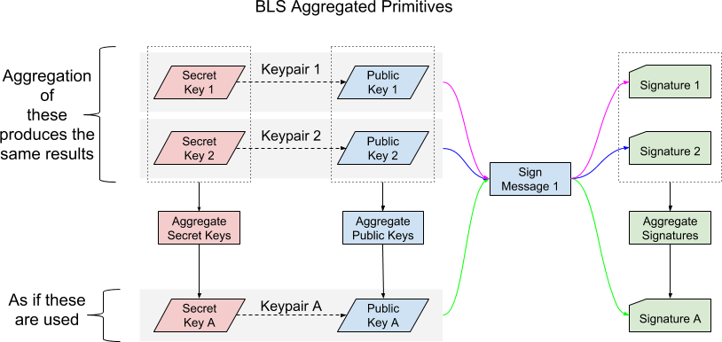

# BLS Signature Scheme

<pre>
  Title: BLS Signature Scheme
  Author(s):  Alexander Block
  Special-Thanks: Cofresi, Darren Tapp, Thephez, Samuel Westrich
  Comments-Summary: No comments yet.
  Type: Supporting Document
  Created: 2018-09-07
  License: MIT License
</pre>

## Abstract

This supporting document gives an introduction into the BLS (Boneh–Lynn–Shacham) signature scheme. BLS is going to be used in several DIPs and this document serves as a reference for them. This document concentrates solely on the BLS primitives and their properties. Other documents will be referenced to describe the mathematical internals of BLS.

## Short introduction to BLS

[BLS](https://en.wikipedia.org/wiki/Boneh%E2%80%93Lynn%E2%80%93Shacham) is a signature scheme which was initially proposed by Dan Boneh, Ben Lynn and Hovav Shacham. A detailed description of the scheme can be found [here](http://crypto.stanford.edu/~dabo/pubs/abstracts/aggreg.html). The scheme is to some degree comparable with ECDSA and allows to verify the authenticity of arbitrary messages (e.g. p2p messages or transactions). It however has a few properties which are unique to BLS that will be described in the next section.

## Properties of BLS

BLS has a few unique properties which will allow Dash to implement higher level functionality while keeping the overhead on the blockchain to a minimum.

### Short Signatures

BLS signatures are generally shorter than signatures from other signature schemes. However, depending on the curves used, public keys might be larger than in other schemes. This negates the space savings if the BLS signature scheme is naively used for transaction signatures. In this case, significant space savings can only be achieved by leveraging the other BLS properties.

### Aggregatable

All BLS primitives (secret keys, public keys, signatures) are aggregatable, so two primitives of the same type can be combined into a single primitive of the same type. Aggregation can be performed in any order and with no practical limit on the number of aggregated primitives. Already aggregated primitives can also be further aggregated.

### Correlation

BLS primitives which correlate to each other still correlate to each other when the same arithmetical operations are performed on each of them. This holds true for simple operations like aggregation and also for more complex operations like polynomial evaluation and interpolation.

If two secret keys are aggregated, the result is a new valid secret key. If the two corresponding public keys of the secret keys are aggregated, the result is a new public key that matches the public key of the aggregated secret key. If two signatures are aggregated which were created with the two previously aggregated secret keys and the same message hash, the new signature would also validate against the aggregated public key.

### Uniqueness and determinism

BLS signatures are unique and deterministic. For any given public key and message combination, there can only be one valid signature. It’s not possible to have two different signatures that validate against the same public key and message. This is very different than ECDSA, where the use of randomness inside the signature results in multiple possible signatures for the same public key and message.

This has a few positive effects when hashing other messages which contain a BLS signature. Such a message (e.g. a Dash or Bitcoin transaction) will always result in the same hash and it’s impossible to modify a signature so that the message remains valid while producing a different hash.

These properties also hold true in combination with the correlation property. If, for example, signatures are created with a threshold scheme, the resulting signature will also be deterministic and unique independent of the subset of signature shares used as input.

## BLS Primitives

The following primitives are available in the BLS signature scheme.

### Secret Key

Comparable to secret keys in ECDSA and other signature schemes. It must be kept secret and is used to create signatures.

Multiple secret keys can be aggregated to create a new secret key. If a signature is created with an aggregated secret key, the resulting signature validates against the aggregate of the public keys derived from the input secret keys. The public key of an aggregated secret key matches the aggregate of the public keys derived from the input secret keys.

### Public Key

Comparable to public keys in ECDSA and other signature schemes. It can be derived from a secret key. It is used to validate a signature together with the corresponding message hash.

Multiple public keys can be aggregated into a single public key. Such an aggregated public key validates against aggregated signatures created with the corresponding private keys.

### Signature

Comparable to signatures in ECDSA and other signature schemes, with the difference that it does not involve randomness, making the signature deterministic and unique.

Multiple signatures can be aggregated into a single signature. If all input signatures were created with the same message hash, the aggregated signature will validate against the aggregated public key of the secret keys used to used to produce the individual input signatures. If different hashes were used, aggregated verification is required.

### Message Hash

The message hash is what is actually signed with a secret key. It is highly advised to include the public key when calculating the message hash and this will be enforced through Dash’s internal wrappers around the external BLS libraries. See “Rogue Public Key Attacks” for more details.

### Id

The Id is just a number and can by anything to identify an entity. It can, for example, be the index into a list or the hash of some object (e.g. ProTxId).

The Id is used in the polynomial functions of Shamir’s Secret Sharing scheme. It is the “x” parameter of the evaluated polynomial.

## BLS Operations

The following operations are possible in the BLS signature scheme. Inside Dash, these are implemented as part of the wrappers around the external BLS libraries.

### Sign(secretKey, messageHash, publicKey)

Creates a signature using the secret key and Hash(messageHash, publicKey). Hashing the concatenation of the messageHash and the public key is done to ensure uniqueness of the actually signed message and serves as a protection against the rogue public key attack.

### Verify(sig, messageHash, publicKey)

Verifies the given signature against the public key and Hash(messageHash, publicKey)..

### VerifyAggregated(aggregatedSig, messageHashes, publicKeys)

Verifies the given aggregated signature against the given message hashes and public keys. Each entry in the messageHashes list must correspond to the entry at the same position in the publicKeys list.

### Aggregate(a, b)

Aggregates two BLS primitives. This is possible with secret keys, public keys and signatures.

Aggregation is an operation with associative property, meaning that the order in which aggregation happens is not important.

## Rogue Public Key Attacks

BLS Public Keys which are published in an untrusted way pose the risk of Rogue Public Key Attacks. This requires an attacker to publish a crafted public key targeted at a specific user. This public key can then later be used to create a signature which validates against the aggregate of the rogue public key and the targeted users public key. This is described in more detail in [BLS Multi-Signatures With Public-Key Aggregation](https://crypto.stanford.edu/~dabo/pubs/papers/BLSmultisig.html).

As a defense, it’s generally advised to either require a proof of possession (the public key signed with the secret key) or to make all messages distinct (e.g. by including the public key in the message hash).

We chose to enforce distinct messages when signing with a secret key. Dash’s internal wrappers around the external BLS libraries will require providing the public key which is used to ensure uniqueness of signed messages. Please refer to the “Sign” operation in the previous section for details.

## BLS Curves used

The BLS signature scheme requires pairing-friendly curves to be used, of which only a few suitable exist. Dash is
using the BLS12-381 with reversed G1 and G2 groups. A specification can be found in the Chia [bls-signatures](https://github.com/Chia-Network/bls-signatures/blob/master/SPEC.md)
repository.

## Serialization format of BLS primitives

It is necessary to serialize BLS primitives into a byte representation so that they can be used inside other serialized data structures.
The serialization format is described in the Chia [bls-signatures](https://github.com/Chia-Network/bls-signatures/blob/master/SPEC.md)
repository.

The size of individual BLS primitives is fixed:

| Type | Size | Description |
| -- | -- | -- |
| BLSSecKey | 32 | BLS secret key
| BLSPubKey | 48 | BLS public key
| BLSSig | 96 | BLS signature

Please note that there is no length field before the primitives serialized data. This is different from ECDSA signatures
where a compact size integere is prepended.

## Copyright

Copyright (c) 2018 Dash Core Team. [Licensed under the MIT License](https://opensource.org/licenses/MIT)
