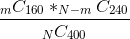
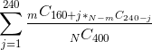

<pre>
  DIP: 0008
  Title: ChainLocks
  Author(s): Alexander Block
  Special-Thanks: Andy Freer, Samuel Westrich, Thephez, Udjinm6
  Comments-Summary: No comments yet.
  Status: Final
  Type: Standard
  Created: 2018-11-16
  License: MIT License
</pre>

## Table of Contents

1.  [Abstract](#abstract)
1.  [Motivation](#motivation)
1.  [Prior Work](#prior-work)
1.  [Used LLMQ type](#used-llmq-type)
1.  [Safe transactions](#safe-transactions)
1.  [P2P message structure](#p2p-message-structure)
1.  [Signing blocks](#signing-blocks)
    1.  [Signing blocks using single LLMQ](#signing-blocks-using-single-llmq)
    1.  [Signing blocks using multiple LLMQs](#signing-blocks-using-multiple-llmqs)
1.  [Handling of signed blocks](#handling-of-signed-blocks)
    1.  [Handling of blocks signed via a single LLMQ](#handling-of-blocks-signed-via-a-single-llmq)
    1.  [Handling of blocks signed via multiple LLMQs](#handling-of-blocks-signed-via-multiple-llmqs)
1.  [Conflicting signed blocks](#conflicting-signed-blocks)
1.  [Implications of a signed block](#implications-of-a-signed-block)
1.  [Network partitions](#network-partitions)
1.  [Initial Block Download](#initial-block-download)
1.  [Calculations](#calculations)
1.  [Security Considerations](#security-considerations)
1.  [Copyright](#copyright)

## Abstract

This DIP introduces ChainLocks, a technology for near-instant confirmation
of blocks and finding near-instant consensus on the longest valid/accepted
chain. ChainLocks leverages LLMQ Signing Requests/Sessions to accomplish
this.

## Motivation

When a node encounters multiple valid chains, it sets the local "active" chain
by selecting the one that has the most accumulated work. This is generally
known as the “longest-chain” rule as in most cases it is equivalent to
choosing the chain with the most blocks.

If both chains have the same amount of accumulated work (and in most cases the
same block count), a decision can’t be made solely based on the longest-chain
rule. In that case, the first chain received by the node is chosen to be the
active one and the other chain is put aside. If another block is then received
which extends the non-active chain so that it has the most accumulated work, it
becomes the active one. For example, even if a chain is currently 6 blocks
longer than any other chain, it’s still possible that a shorter chain becomes
longer and thus the active one. This is generally known as a chain
reorganization.

The most common situation where this happens is if two miners find a block at
approximately the same time. Such a block would race in the network and one
part of the network would accept one block as the new active chain while
another part of the network would accept the other block. In most cases,
whoever finds the next block also indirectly resolves the situation as the new
block’s parent block determines which of the chains will be the longest one.
This is generally known as orphaning of blocks.

It might also happen by accident. For example, if parts of the network with a
high hashrate are partitioned and miners are unaware of other miners mining on
another chain. When the network becomes healthy again, multiple chains will
exist that all branch from a common ancestor. While these chains are
propagated, one side of the previously partitioned network will have to
reorganize their local chain to the chain of the other side.

It can also happen on purpose if a miner with more hashrate than all other
miners combined decides to ignore other miner’s blocks and only mine on top
of their own blocks. This is generally known as the 51% mining attack. A miner
can even go as far as not publishing any blocks for some time so the remainder
of the network is not aware of the attack until they suddenly publish the
longer secret chain.

In all these cases, uncertainty arises for individual recipients of funds. When
a reorganization happens, it is not necessary for the new chain to include the
same transactions as the old chain. In addition to including new transactions
and excluding old transactions, it is possible to include transactions in the
new chain which are in conflict with the old chain. This means that a new chain
might send funds from the same inputs to another address. This results in the
only valid form of double spending possible in Dash (InstantSend is not
double-spendable even for this case) and most other Bitcoin based
cryptocurrencies.

This DIP proposes a new method, called ChainLocks, for reducing uncertainty
when receiving funds and removing the possibility of 51% mining attacks.

## Prior work

- [DIP 006: Long Living Masternode Quorums](https://github.com/dashpay/dips/blob/master/dip-0006.md)
- [DIP 007: LLMQ Signing Requests / Sessions](https://github.com/dashpay/dips/blob/master/dip-0007.md)

## Used LLMQ type

All signing sessions/requests involved in ChainLocks must use the LLMQ_400_60 LLMQ type.

## Safe transactions

In general, all valid blocks could also be considered for ChainLocks. There is a small
risk of confirmed transactions conflicting with InstantSend locks. To resolve these conflicts,
ChainLocks need to be prioritized over InstantSend locks when conflicts arise.

As such conflict resolution is quite severe and in some sense voids all the security gained
by InstantSend, it is desirable to reduce the probability of such conflicts to practically zero.

This can be achieved by a change in block template generation. Miners are encouraged to only
include “safe” transactions in blocks. A transaction is considered safe if it is InstantSend
locked or locally known for at least 10 minutes without a conflicting InstantSend lock
appearing in the meantime. The default implementation for block template generation
(as found in Dash Core) will be changed to honor this.

At the same time, masternodes should only try to sign/lock blocks which include only "safe"
transactions. This means that ChainLocks will only be created when the whole block
is considered "safe". Consequently, the probability of a conflicting InstantSend lock
appearing after the creation of the ChainLock is practically zero.

This assumes that [DIP-0010 LLMQ based InstantSend](https://github.com/dashpay/dips/blob/master/dip-0010.md)
is already implemented as it changes InstantSend behaviour to try to lock all transactions
instead of just a few selected ones.

DIP-0010 also implements "retroactive signing of transactions", which guarantees that transactions
are InstantSend locked in a retroactive way if they were unknown before appearing in a
mined block. This prevents blocks which contain unlocked transactions from suppressing
ChainLocks, as it allows the ChainLocks system to sign blocks retroactively as well.

## P2P message structure

ChainLocks are relayed through the P2P network via a `CLSIG` message which has
the following structure:

| Field | Type | Size | Description |
|--|--|--|--|
| height | int32 | 4 | Height of the signed block |
| blockHash | uint256 | 32 | Hash of the signed block |
| sig | BLSSig | 96 | Recovered BLS signature |
| signersSize | compactSize uint | 1-9 | Bit size of the signers bitvector. Must be equal to the number of active quorums. Only used by nodes running on version 70220 or newer. |
| signers | byte[] | (signersSize + 7) / 8 | Bitset representing the aggregated signers of the BLS signature. The first bit represents the participation of the most recent LLMQ and the last bit the participation of the oldest LLMQ with the following meaning of a bit: <ul><li>`0` Quorum didn't provide a valid `CLSIG`</li><li>`1` Quorum provided a valid `CLSIG`</li></ul> Only used by nodes running on version 70220 or newer. |

## Signing blocks

Signing is done by invoking the [DIP0007 `SignIfMember` operation](https://github.com/dashpay/dips/blob/master/dip-0007.md#void-signifmemberuint256-id-uint256-msghash-int-activellmqs).

The request id to sign a block must be calculated deterministically for
each `blockHeight`.

The message hash is always the hash of the signed block.

The sign hash for the BLS signature is calculated as
`SHA256(llmqType, quorumHash, requestId, blockHash)`, where `llmqType` and
`quorumHash` are taken from the corresponding LLMQ.

There are two possible ways to form a ChainLock: using a single LLMQ and using
multiple LLMQs. We use `SPORK_19_CHAINLOCKS_ENABLED` spork to signal which
method should be used by the network: `0` - single LLMQ, `1` - multiple LLMQs.

### Signing blocks using single LLMQ

This is the default method which can be used by all nodes.

The request id in this case is `SHA256("clsig", blockHeight)`.

After a LLMQ member has successfully recovered the final ChainLocks
signature, it must create a `CLSIG` P2P message and propagate it to all nodes
through the inventory system.

### Signing blocks using multiple LLMQs

This is an optional method which can be used only by nodes running on protocol
70220 or newer.

The request id for each LLMQ is calculated as `SHA256("clsig", blockHeight, quorumHash)`.

After a LLMQ member has successfully recovered the final ChainLocks signature
for its LLMQ, it must create a `CLSIG` P2P message and propagate it to non-SPV nodes
through the inventory system.

## Handling of signed blocks

The node should ensure that the fully signed block is locally accepted as the
next block. If the correct block is already present locally, its chain should
be activated as the new active chain tip. If the correct block is not known
locally, the node must wait for this block to arrive and request it from other
nodes if necessary. If the correct block is already present locally and
an alternative block for the same height is received, the alternative block
must not be added to the currently active chain.

If a block has been received locally and no `CLSIG` message has been received
yet, it should be handled the same way it was handled before the introduction
of ChainLocks. This means the most-work and first-seen rules must be
applied. When the `CLSIG` message for this (or another) block is later
received, the below logic must be applied.

### Handling of blocks signed via a single LLMQ

Upon receipt, each node must perform the following verification before
announcing it to other nodes:

  1. Based on the deterministic masternode list at the given height,
  the set of active quorums must be calculated.
  2. The request id must be calculated.
  3. The quorum must be selected from the set based on the calculated request id.
  4. The BLS signature must verify against the quorum public key and the sign hash.

The first seen `CLSIG` for a known block is the one that should be used to lock the chain.

### Handling of blocks signed via multiple LLMQs

This is an optional method which can be used only by nodes running on protocol
70220 or newer.

If the `signers` bitset has exactly 1 bit set, each node must perform the
following verification before announcing it to other nodes:

  1. Based on the deterministic masternode list at the given height,
  the set of active quorums must be calculated.
  2. The request id and sign hash must be calculated.
  3. The BLS signature must verify against the quorum public key and the sign hash.

When using multiple LLMQs, the node must wait for the majority of LLMQs to sign
the same block hash and then a new `CLSIG` message with an aggregated `sig` and
a combined `signers` field should be formed and relayed to other nodes, including SPV ones.

If the `signers` bitset has at least `signersSize / 2 + 1` bits set to `1`, each node
must perform the following verification before announcing it to other nodes:

  1. Based on the deterministic masternode list at the given height,
  the set of active quorums must be calculated.
  2. The request id and sign hash of all quorums which successfully participated
  to the aggregated signature must be calculated.
  3. The BLS signature must verify against the set of quorum public keys and the set
  of corresponding sign hashes of all quorums which successfully participated
  to the aggregated signature.

The first seen aggregated `CLSIG` for a known block is the one that should be used to lock the chain.

## Conflicting signed blocks

It is possible for a malicious quorum to double-sign two different blocks
and to produce two valid conflicting recovered signatures. When using multiple
LLMQs, `CLSIG` messages from honest LLMQs should still form a majority and lock
the chain. In the worst case, with two malicious quorums or with one malicious
quorum and a honest one which is not functioning properly, no majority is formed
and nodes fall back to the first-seen and most-work rules. Note that there must
be an even number of active quorums for this to work as described.

## Implications of a signed block

If a block was successfully signed, it can be safely assumed that no chain
reorganization before this block can happen, as all nodes would agree to reject
blocks with a lower height. This means that each transaction in this block and
all previous blocks can be considered irreversibly and instantly confirmed.

For InstantSend, this also means that the minimum of 6 confirmations of the
parent transaction can be removed if the parent transaction is inside or below
a signed block.

## Network partitions

If there is a network partition, the most likely thing to happen is that just
one side is able to mine a signed chain. The other side will encounter
non-signed blocks building on top of the last signed block. Miners who observe
this must assume that another currently unobserved chain is being built in
parallel. Since the parallel chain might be signed and could possibly overtake
their own chain after the network is healthy again, miners should act
accordingly (e.g. reduce hash power to reduce costs).

If the network is partitioned to a degree that makes a majority in the
responsible LLMQ impossible, all partitions in the network will be unable to
produce a signed chain. After the network is healthy again, one part of the
network will reorganize itself to the other’s chain after which the
responsible LLMQ will sign the new chain tip.

## Initial Block Download

While fully synced, nodes will usually receive `CLSIG` messages for new blocks
shortly after they are mined. If a node was offline for some time or has to
perform an initial block download, the signatures for old blocks will not be
present in the initial implementation.

Nodes should fall back to the plain “longest-chain” and “first-seen”
rules in this case until the first block signature for a new block is received.

We assume that old blocks are secure enough to not encounter any significant
forks which could lead to a different chain tip after initial block download is
finished. When the chain tip is reached, the first received signature will
resolve any ambiguities which might occur in the last few blocks.

If the need arises to include block signatures in initial block download, we
will update this DIP and implementations accordingly.

## Calculations

We consider the scenario where an attacker has assumed control of a number of
masternodes. We will then calculate two probabilities that the attacker will
be able to disrupt the network. Specifically, we will calculate the probability
that an attacker will be able to prevent all ChainLocks for a twelve hour period,
and we will calculate the probability that an attacker can successfully create
a malicious or erroneous ChainLock.

The consequences of an attacker withholding ChainLocks would be that the network
would fall back on proof of work.  The consequence of a malicious or erroneous
ChainLock might depend on the attackers motivations.  An attacker with
control of a ChainLock quorum would be able to:
1. Produce conflicting ChainLocks.
2. Withhold ChainLocks and then issue a ChainLock for a conflicting previous block
not included in the current chain of most work.
3. Secure undo advantage.

We assume that all masternodes not under malicious control are
behaving as expected. In practice this is generally observed.  In theory,
it is possible for some nodes to be unreachable, or the attacker could
combine a DoS attack in conjuction with compromising nodes. If this is the case, it
would become more likely an attacker could withhold ChainLocks, and not
be any more likely the attacker could produce a malicious ChainLock.
Our calculations can easily be modified to model the network operating
under other assumptions.

In this section we will show that the random selection of a LLMQ will
not allow an attacker to control a ChainLock quorum without control of a
supermajority of masternodes.

Quorum selection is designed to provide for an effectively simple random
choice of masternodes in each quorum. Thus we may assume that each quorum is
a simple random selection. If there are a total of 'N' masternodes the
number of possible quorums is the number of ways that 400 objects can be
chosen out of `N`. In some literature this number is
written `N``C``400` and is enunciated as
'N choose 400'. Numbers that arise in this fashion are all
binomial coefficients and have a delightful relation to Pascal's Triangle.

For any process with an observable outcome the set of all outcomes is
called a sample space.  If all outcomes are equally likely, as in the
selection of a quorum, the probability of any event is the number of
outcomes that satisfy that event over the total number outcomes.

An attacker can temporarily prevent ChainLocks if they control
`161` out of 400 masternodes in the quorum.  If the attacker controls
`m` out of the `N` total masternodes we can compute the
number of outcomes that satisfy the event "exactly `161`
nodes of the quorum are controlled by the masternode."
Specifically there are
`m``C``161` * `N - m``C``239`
 outcomes where the attacker controls exactly `161` masternodes.
Thus, the probability that the attacker controls exactly `161` nodes is

The attacker could also be successful if they control <b>more</b> than `160`
of the nodes in the quorum selection. Thus the exact probability that an
attacker can successfully prevent ChainLocks for that quorum round is
computed by counting the number of outcomes where the attacker controls
160 or more nodes in the quorum divided by the total number of outcomes.
This is computed by the sum

The numbers involved in this sum can be quite large. We may
use a <A HREF="dip-0008/quorum_attack.py">Python Script</A> to effectively
evaluate this sum. Note
that we made the necessary modifications to this formula
to calculate the probability that an attacker controls 60% or more
of the quorum.

| N | m | Success probability of withholding a ChainLock | Success probability of creating a malicious ChainLock |
|---|---|--------------|--------------------------------|
|5000|500| 3.32e-65 |  7.11e-157|
|5000|1000| 1.69e-22 | 2.89e-76 |
|5000|1500| 3.36e-6 | 1.29e-38 |
|2000|200 | 2.12e-87 | 0 |
|2000|400 | 1.80e-26 | 9.49e-94 |
|2000|600 | 6.20e-7 | 3.94e-45 |

In all scenarios above, an attacker should not expect to withhold a
ChainLock in the next century. The attacker would have a less than
one in 100 trillion chance of producing at least
one malicious ChainLock in the next sextillion (10^21) years.

From these calculations we conclude that an attacker with control of fewer
than 30% of all masternodes will not have any influence on ChainLocks. For
completeness we note that
if an attacker controlled 50% of masternodes an attacker would
generally be able to prevent ChainLocks, but there is less than 30 out of
one billion chance that the attacker will be able to produce at least one
malicious ChainLock in the next million years.

## Security Considerations

It is of note that it is not required for an attacker to actually own the
collateral of masternodes that the attacker controls. A company offering
the service of hosting masternodes for clients could be persuaded to run
malicious software. Also if node operators do not check the digital signature
there could be a malicious download or software that spoofs being an
official download. We recommend mitigations of both these side channel attacks.

It is recommended that Dash users require some transparency
from masternode hosting services.  It should be expected that a
masternode hosting service disclose all masternodes that it hosts as a
service.  It is then recommended that those who utilize a masternode hosting
service check that their node is listed in the disclosure.  This
information could help identify if nodes hosted by services are
behaving as expected.

It is always recommended that users check the signature on any software they
download. As long as the correct public key is acquired then it is
cryptographically not possible for the official download to be spoofed.

## Copyright

Copyright (c) 2018 Dash Core Group, Inc. [Licensed under the MIT
License](https://opensource.org/licenses/MIT)
