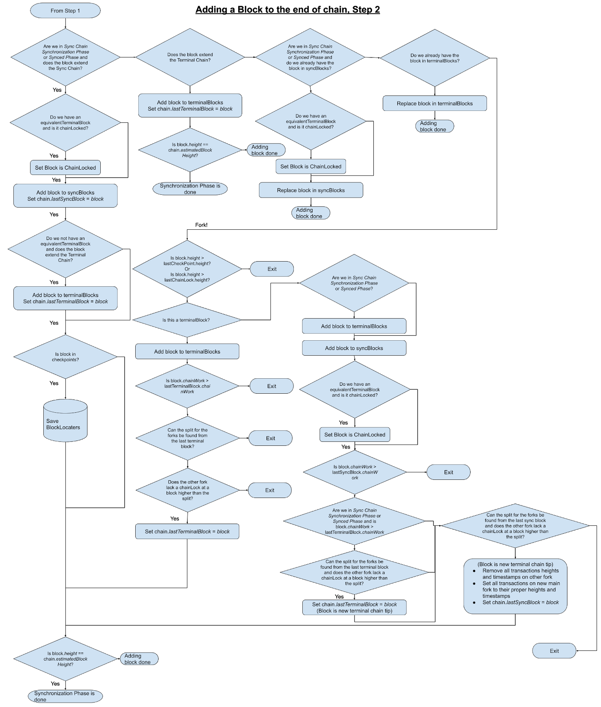

<pre>
  DIP: 0016
  Title: Headers First Synchronization on Simple Payment Verification Wallets
  Author(s): Samuel Westrich
  Special-Thanks: Eric Britten, Thephez
  Comments-Summary: No comments yet.
  Status: Proposed
  Type: Informational
  Created: 2020-11-30
  License: MIT License
</pre>

# Table of Contents

1. [Abstract](#abstract)
1. [Motivation](#motivation)
1. [Prior Work](#prior-work)
1. [Terminology](#terminology)
1. [Checkpoints](#checkpoints)
1. [Masternode List Checkpoints](#masternode-list-checkpoints)
1. [Headers First Synchronization](#headers-first-synchronization)
1. [Appendix Diagrams](#appendix-diagrams)
1. [Copyright](#copyright)

# Abstract

This document details the process of implementing Headers-first synchronization on a wallet.

# Motivation

With the advent of Dash Platform, mobile wallets have a real incentive to receive Platform data as
soon as possible. Since Dash Platform relies on a Practical Byzantine Fault Tolerance (pBFT) based
consensus that uses long living masternode quorums (LLMQs), it is ideal to retrieve and verify these
quorums before starting a potentially lengthy wallet synchronization. After these quorums are
retrieved, wallets can make use of all applications of Dash Platform including those that influence
Dash Core chain synchronization.

# Prior work

* [DIP-0003: Deterministic Masternode
  Lists](https://github.com/dashpay/dips/blob/master/dip-0003.md)
* [DIP-0004: Simplified Verification of Deterministic Masternode
  Lists](https://github.com/dashpay/dips/blob/master/dip-0004.md)
* [DIP-0008: ChainLocks](https://github.com/dashpay/dips/blob/master/dip-0008.md)
* [DIP-0011: Identities](https://github.com/dashpay/dips/blob/master/dip-0011.md)
* [BIP-0037: Peer Services](https://github.com/dashevo/bips/blob/master/bip-0037.mediawiki)

# Terminology

**Main Chain**: The dominant chain with the most aggregated chain work. The main chain always
extends from the block that the last known ChainLock has locked, if one exists.

**Terminal Headers**: The headers at the tip of the chain. The number of terminal headers should
always be greater than the longest possible distance of a valid LLMQ creation height to the chain
tip. Also known as terminal blocks.

**Sync Blocks**: The blocks that are being synced to retrieve wallet transactions. These are merkle
blocks for SPV wallets but should be referred to as Sync Blocks for simplicity.

# Checkpoints

Mobile wallets have long used hardcoded checkpoints in order to speed up initial synchronization as
well as protect against attacks. A pertinent example of such an attack would be a deep fork attack
where the attacker would mine a long chain forking at an early block height. This fork would have to
have a higher chainwork than the original fork and would need at least to be longer than the number
of blocks the SPV wallet keeps in memory. The perfect solution to this problem is to make sure that
wallets keep more chain sync blocks in memory than the distance between checkpoints. A less perfect
solution is to keep in memory enough blocks that it becomes cost prohibitive for miners to perform
such an attack.

Checkpoints must contain the following information:

1. Height (uint32): The height of the block
2. BlockHash (uint256): The hash of the block
3. Block Timestamp (uint32): The timestamp included in the header of the block
4. Block Target (uint32): The compact target of the block
5. ChainWork (uint256): The aggregated chainwork of the block

Checkpoints can also contain:

* Masternode List: The masternode list at the specified block. This should be included in
  checkpoints as a reference to a blob or file that contains the DIP4 masternode list message
  between block zero (the genesis block) and the height of the block.
* Merkle Root: The previous message should be verified. The message contains a coinbase transaction.
  With the block merkle root and merkle proofs in the DIP4 message, we can check that the masternode
  list is valid.

# Masternode List Checkpoints

Syncing the full masternode list from block zero (the genesis block) is a resource intensive
operation that requires decent bandwidth and a good internet connection. A powerful optimization is
to keep at least one masternode list as a file inside the wallet. This masternode list would be then
referenced by a checkpoint.

# Headers First Synchronization

The goal of the headers first synchronization is to get the chain tip masternode list and LLMQs as
quickly as possible and before receiving merkle blocks. This last part is extremely crucial as the
transactions desired in merkle blocks may vary based on specific Dash Platform application
information. DashPay is a good example of this where contact requests add address spaces that need
to be included in the bloom filter.

Headers first synchronization is done in multiple steps:

1. Retrieve the chain’s estimated height from multiple peers.
2. Perform a headers only synchronization from the last known checkpoint or block to the chain tip.
3. Retrieve the terminal masternode list and quorums if needed.
4. Retrieve masternode lists required to verify quorums if needed.
5. Verify quorums if needed.
6. Retrieve wallet Identities.
7. Retrieve wallet platform data associated with Identities.
8. Construct probabilistic filter (bloom filter).
9. Start syncing chain from the last known sync block if it exists or any checkpoint before the
   wallet creation date if it does not.

## Sync Phases

We define four chain synchronization phases as follows:

* Offline
* Initial Terminal Blocks Retrieval Phase
* Sync Blocks Retrieval Phase
* Synced Phase

_Offline_ is the resting state of the application if no peers are connected. Every time all peers
are disconnected, the chain synchronization phase should revert to Offline. The Offline Phase
encompasses connecting to peers and the retrieval of the chain estimated height.

_Initial Terminal Blocks Retrieval Phase_ encompasses steps 2 through 7.

_Sync Blocks Retrieval Phase_ encompasses steps 8 and 9.

See [Appendix Flow Chart 1](#part-1) for a visualization of the processes between these
synchronization phases.

## Estimated chain height

Before retrieving headers it is helpful to agree on the current chain’s estimated height. This can
provide wallet users an estimate on the percentage of work completed (potentially in the form of a
progress bar). When connecting to peers, the wallet will receive these heights in the `version`
message. Through soft consensus these heights can be used to determine the end of the chain.

## Initial headers synchronization

The goal of the initial headers synchronization is to get the latest valid block on the main chain.
This block is then used to retrieve a valid masternode list and quorums that can be verified with
the newly acquired terminal headers.

A client should retrieve these headers in batches through P2P or DAPI from the download peer, verify
them and add them to a data structure such as an array that contains all terminal blocks.

Each `getheaders` response should contain the maximum number of headers that are allowed. In
protocol version 70218 and prior (core version 0.16), this is set to 2000. It may change in a future
protocol version. If a `getheaders` response contains less than this maximum, it means that we have
reached the end of the chain, and after verifying headers we should move on to the next step of the
process.

On each future step of the process, terminal headers should still be retrieved after an inventory
message and should be added to the terminal headers chain tip if they pass validation and consensus
rules.

## Getting and verifying LLMQs (Steps 4, 5 and 6)

This step is explained in depth by [DIP4](https://github.com/dashpay/dips/blob/master/dip-0004.md).
After this step as terminal headers continue coming in, masternode lists and quorums should
continuously be updated, even during main chain synchronization.

## Retrieve Identities associated with wallet

Identities are registered with associated public keys. Identities can be queried based off of the
first associated public key through Dash Platform. The query should use the first public key at a
specific derivation path used for Identities. If an Identity is found, the process should be
repeated for another public key at the following derivation path. This should continue until no
Identity is returned by the platform. Proofs of existence and non-existence must be verified in the
responses to these requests.

## Retrieve application information from Dash Platform

Different decentralized applications might have pertinent information for the wallet. For example,
extra address spaces that wallet accounts are interested in. Another example could be wallet
creation date to speed up initial download. This information should be downloaded from Dash
Platform, processed and then used as parameters for the main chain synchronization step.

## Constructing a probabilistic filter

When syncing blocks through SPV, a bloom filter is used (see BIP37). In addition to the BIP44-based
address spaces included in the filter, extra address spaces retrieved from Dash Platform
applications can be used. For example, in DashPay this enables receiving and sending transactions on
SPV wallets that use bloom filters.

A client should set this filter on all connected peers.

## Chain Sync Blocks retrieval

After setting the probabilistic filter, retrieval of sync blocks should start. If not syncing from
scratch, the last 10 sync blocks followed by the previous checkpoint and then the chain genesis
should be used as locators sent in a `getblocks` message. If syncing from scratch, the last
checkpoint and then the chain genesis should be used as locators. If the wallet creation date is
known, `getheaders` can be used instead of `getblocks` until the last known sync block timestamp is
5 days before the wallet creation date.

When receiving a response to a `getblocks` message, the wallet should immediately request the
following blocks before verifying the blocks that were in the response. This process should continue
until all blocks have been retrieved and sync blocks have caught up to terminal blocks. At this
point the wallet will be in a Synced Phase and will only need to listen to mempool inventory
messages and retrieve blocks through those inventory messages.

# Categorization of Blocks from peers

Since terminal blocks can still be retrieved during chain sync, current chain sync phase should not
be used to determine the block categorization between terminal blocks, chain sync blocks or both.
Appendix Diagrams 1 and 2 explain through flow charts the logic to apply to figure out this
categorization.

# Appendix Diagrams

## Synchronization Phases

## Adding a Block to the Chain

### Part 1

### Part 2

# Copyright

Copyright (c) 2020 Dash Core Group, Inc. [Licensed under the MIT
License](https://opensource.org/licenses/MIT)
