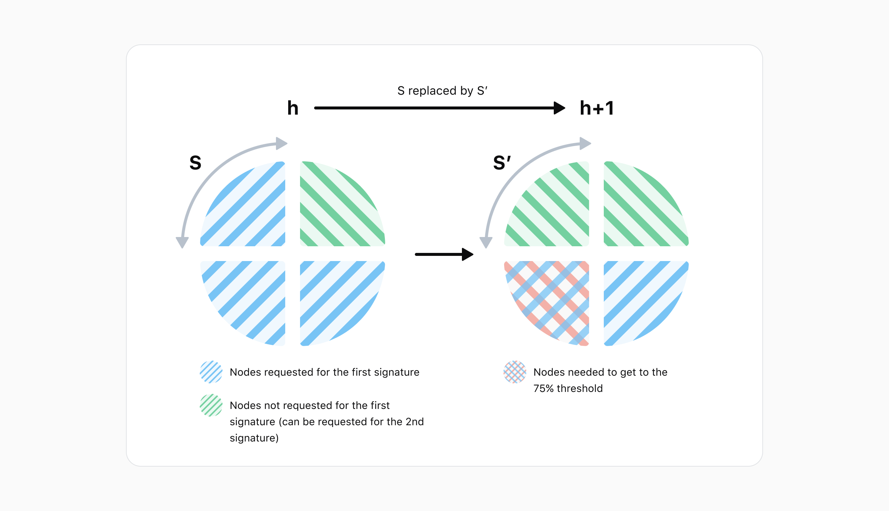

<pre>
  DIP: 0024
  Title: Long-Living Masternode Quorum Distribution and Rotation
  Author(s): Samuel Westrich & Virgile Bartolo
  Special-Thanks: Eric Britten, Odysseas Gabrielides, Thephez, UdjinM6
  Comments-Summary: No comments yet.
  Status: Draft
  Type: Consensus (hard fork)
  Created: 2022-04-13
  License: MIT License
</pre>

# Table of Contents

1. [Abstract](#abstract)
1. [Motivation](#motivation)
1. [Prior Work](#prior-work)
1. [Double signing attack](#double-signing-attack)
1. [General notes](#general-notes)
1. [Quorum Composition](#quorum-composition)
    * [Quorum Indexing](#quorum-indexing)
    * [Quorum Formation](#quorum-formation)
    * [Optimal share count analysis](#optimal-share-count-analysis)
1. [Changes from previous LLMQ DIPs](#changes-from-previous-llmq-dips)
    * [Changes to the initialization phase](#changes-to-the-initialization-phase)
    * [Choosing the active quorum to perform signing](#choosing-the-active-quorum-to-perform-signing)
    * [Quorum Count and DKG Interval](#quorum-count-and-dkg-interval)
1. [Light Client Support](#light-client-support)
   * [Reconstructing LLMQ Quarters](#reconstructing-llmq-quarters)
   * [Quorum Snapshots](#quorum-snapshots)
   * [Simplified Verification of LLMQs](#simplified-verification-of-llmqs)
1. [Handling DKG Failure](#handling-dkg-failure)
1. [Implementation notes](#implementation-notes)
1. [Copyright](#copyright)

# Abstract

This document provides a solution that improves the distribution of masternodes in InstantSend Long
Living Masternode Quorums (LLMQs) across the Dash masternode network and prevents potential double
signing attacks when InstantSend quorums are replaced. This will be done through a process we name
quorum cycling.

# Motivation

Before implementing and activating the solution presented in this paper, a very well-timed attack
could lead to a double sign when new quorums replace old ones. At the same time, since masternode
members were pseudo-randomly selected for quorums, some masternodes could be chosen for a large
number of quorums while others were selected for none.

This DIP introduces a quorum rotation strategy in which only a quarter of members change at a time.
This DIP also homogenizes the distribution of masternodes into quorums. Of all the solutions
considered, this one was selected since it integrates more seamlessly into the current system.

# Prior Work

* [DIP-0004: Simplified Verification of Deterministic Masternode Lists](https://github.com/dashpay/dips/blob/master/dip-0004.md)
* [DIP-0006: Long-Living Masternode Quorums](https://github.com/dashpay/dips/blob/master/dip-0006.md)
* [DIP-0007: LLMQ Signing Requests / Sessions](https://github.com/dashpay/dips/blob/master/dip-0007.md)

# Double signing attack

Let us first consider the issues with the old system to understand the problem this protocol solves.
In the old system, quorums were pseudo-randomly selected to be responsible for signing sessions. At
the same time, all members of a quorum would be fully replaced simultaneously, thus a block
containing a new quorum commitment transaction would initiate a transfer of signing responsibilities
from the old quorum to the newly created quorum. Since ChainLock messages are time stamped, this
signing transition period could not be exploited to affect ChainLocks. However, InstantSend
messages' lack of a time stamp made them vulnerable to attack during the transition.

## InstantSend locking process

InstantSend locks are obtained by first creating signing requests for each input of a transaction
and providing the full transaction hash alongside it to each of the nodes providing the signature
shares. Once all inputs are locked, the whole transaction is signed in a separate signing session by
a potentially different quorum. Trying to lock the same inputs for multiple transactions results in
failure once the nodes see already locked inputs in a transaction with a different hash.

## Attack details

An attacker could potentially have obtained conflicting input locks by sending one transaction to
the old quorum and a second one containing the same inputs to the new quorum. The new quorum would
have been tricked into signing the second conflicting transaction as they would not have seen the
first signature request. The quorum transition period was normally very short (<5 seconds), but a
significant load on the network could have extended it and opened the door to double spend attacks.

Nodes receiving contradictory InstantSend locks on the Core payment network would remove the
conflicting locks and any descendant transactions from their mempool. If a ChainLock conflicts with
an InstantSend transaction, only the InstantSend transaction is eliminated.

If the attacker was not a miner, nodes would have dropped the conflicting transactions from the
mempool along with any descendant transactions and locks. Consensus would have been restored when
one of the transactions eventually received a ChainLock.

However, suppose the attacker was a miner. In that case, they could potentially have included one
transaction in a block they mined, obtained a ChainLock for the block, and simultaneously obtained
an InstantSend lock for the second transaction. As a result, the ChainLock would have taken
priority, the InstantSend lock would have been dropped, and the transaction's security voided.

## Implications

Previously, the sole potential gain from exploiting the transition period was to double spend to
exchanges that immediately credit InstantSend transactions. On the other hand, Platform uses
InstantSend locks as proof of finality. They are supplied alongside the State Transitions that claim
funds coming from Core. Platform validators then evaluate the InstantSend lock to arrive at
consensus regarding the creation of credits. Although it would be trivial to devise a system where
Dash Platform verifies InstantSend locks based on inputs, this could still lead to an attack whereby
value is transferred on the Core payment chain while also being duplicated on the Platform chain.

Since this attack only concerns InstantSend, the solution presented in this DIP will only be applied
to the quorum type used by InstantSend. Similar solutions could be applied to other quorums in the
future if necessary.

# General notes

The subsequent sections reference several parameters when describing the design and related
calculations. We will refer to these parameters multiple times in the following sections.

Parameters:

* **`c`**: The number of blocks in a cycle. Equal to the quorumDkgInterval as defined in
  [DIP-6](https://github.com/dashpay/dips/blob/master/dip-0006.md#parametersvariables-of-a-llmq-and-dkg).
* **`t`**: The quorum's threshold as a percentage
* **`cycleBlockHash`**: quorumHash of the first Distributed Key Generation (DKG) session

Also, while we refer to block heights for the sake of clarity in this document, only block hashes
are used behind the scenes.

# Quorum Composition

With an understanding of the existing limitations in mind, we will now describe several
modifications to the quorum system that will improve its operation and security. These changes
affect both quorum indexing and quorum formation.

## Quorum Indexing

Before this proposal, new 50-member quorums were formed every 24 blocks and were active for 576
blocks. This resulted in 24 of these quorums being active at any given height. We will keep a fixed
number of quorums per quorum type to enable us to index the quorums. For example, if there are 32
quorums of a particular type, each of them will have an index ranging from 0 to 31.

## Quorum Formation

This proposal introduces two notable changes to the quorum formation process. The changes relate to
when quorums change and how masternodes are selected for quorum participation.

### Concurrent quorum changes

All InstantSend quorums will now change quasi-simultaneously by way of the following algorithm:

The member composition (selection algorithm) for the cycle is calculated by all the nodes at height
`h` when `h mod dkgInterval == 0`.

    -The DKG session for quorumIndex 0 will start at height h when h mod dkgInterval == 0
    -The DKG session for quorumIndex 1 will start at height h when h mod dkgInterval == 1
     ... 
    -The DKG session for quorumIndex i will start at height h when h mod dkgInterval == i

If the first block of the first DKG session is block `h`, then the first block of the last DKG
session is block `h + QuorumNb - 1` (where `QuorumNb` is the number of quorums for this quorum
type). DKG sessions have 6 phases that are 2 blocks long and a mining phase that is 8 blocks long.
Thus, the DKG sessions finish at `h + QuorumNb-2 + 6*2 + 8` which simplifies to `h + QuorumNb + 18`.

The DKG sessions begin at staggered heights for two primary reasons. First, since each quorum's hash
is from the block hash where its DKG session started, forcing each quorum index to start their DKG
at a unique height ensures they will all have different quorum hashes. Second, this benefits the
network by limiting the number of quorums in the same resource-intensive DKG phases simultaneously.

### Masternode selection

Another major change is in the way masternodes are selected to be part of a quorum. In the old
system, this was done based solely on the most recent masternode list. The new system will compose
each quorum by aggregating 4 quorum shares with each share being a quarter of the quorum.

This new system works cyclically. Each cycle, the oldest quarter (produced at height `h-4c`) is
replaced by the newly created quarter while the remaining ¾ of participants remain unchanged (`c` is
the number of blocks in a cycle - equivalent to the DKG interval). This process results in quorums
being totally renewed every 4 cycles.

The diagram below demonstrates the creation of a mock quorum out of four such shares. At each
height, the masternode list is ordered pseudo-randomly, a new share is built from this list, and
then the quorum is composed with the 4 newest shares.

Important notes regarding the diagram:

* The ordering of the list differs at each height. For example, the first masternode at height `h-3`
  is not the same node as the first masternode at height `h-2`.
* The mock quorums' cycles only last 1 block.
* The selection algorithm may skip Masternodes. The details of the algorithm are covered in the
  [“Changes to the initialization phase” section](#changes-to-the-initialization-phase) below.

## Optimal share count analysis

In this subsection, we will explain the rationale for "dividing" quorums into 4 parts instead of 3
or 5, for example. We also show how quorum cycling enables us to protect against double signing by
ensuring that consensus is always maintained.

For analytical purposes, we will consider quorums composed of `S` shares. If our quorum has `S`
shares and one is replaced every cycle, then the rest of the quorum (`S-1` shares) will be the same
as before the rotation process removed that share. We will also assume the attacker can choose which
nodes see each transaction.

Let us consider how the double signing attack works and how it fares against rotations. The attack
consists of two steps:

1. The attacker crafts a message and asks part of the quorum to sign it.
2. After the rotation process, the attacker crafts a contradictory message and asks a different part
   of the quorum to sign it.

There are three types of participant in this scenario:

1. Original members of the quorum that received the first request
2. Original members of the quorum that did not receive the first request
3. Fresh members from the newest share

Original members that received the attacker's first request will refuse to participate in the second
signing request. The remainder of the original members and all members of the new share will be
fooled by the attacker since they did not receive the first signature request. Thus, the best
scenario for the attacker is that all previously requested members are replaced. The attacker can
enforce this since they can determine in advance which nodes will be replaced and issue their
requests accordingly.

This means that for the second signature request, the attacker automatically has acceptance from:

* The changed share. This comprises `100/S` % of the quorum.
* The original members of the quorum that did not receive the first request. This comprises
  `100*(1-t)`%  of the quorum, where `t` is the threshold of the quorum.

Conversely, the attacker has refusals from:

* The masternodes that received the first request but were not replaced. This comprises `t-100/S` %
  of the quorum.

We define the attacker's advantage as the percentage of nodes that are fooled by simply sending this
first request carefully.

    adv :=  1/S + (1 - t) = 1/S + 1 - t

The attacker requires a certain minimum number of byzantine nodes to succeed. This minimum, as a
proportion of the total quorum size, is calculated below with the following assumptions made:
byzantine nodes are in the group that the attacker requested, and they are not replaced.

In this equation, both `t` and `S` can be adjusted to minimize the feasibility of such an attack.

### Example calculations

Let us consider a few examples to illustrate what varying the number of shares and the threshold
accomplish:

| S (shares) | t (threshold) | Nodes required to attack |
|:-:|-|-|
| 3 | 2/3 (67%) | 0% (1 quorum node) |
| 4 | 3/4 (75%) | 25% of quorum nodes |

In the first example, the attacker needs to control 0% of the quorum nodes and could gain a
supermajority by controlling a single quorum node:

    100 * (4/3 - 1/3 - 1)% = 0% 

In the second example, both the share count and the threshold are increased. In this case, the
attacker needs to control 25% of quorum nodes to be successful:

    100 * (6/4 - 1/4 - 1)% = 25%

We see that 3 shares provide virtually no security; thus, at least 4 shares are required to provide
security without increasing the quorum threshold significantly. Since there are also performance and
security incentives to minimize the number of shares, we chose 4 shares for our design. These shares
will be referred to as quarters throughout the remainder of the document. A future DIP will focus on
the difficulty of getting such a percentage of byzantine nodes in a quorum.

Below is a diagram representing what happens in the second example with 4 shares and a threshold `t`
= 75% = 3/4. We see that we need 25% of the quorum under our control to successfully complete the
second signing request and thus the attack.

Finally, we note that while it is easy to simply request your byzantine nodes, it is difficult for
an attacker to ensure that no byzantine nodes are replaced. This means that the preceding analysis
underestimates the difficulty of successfully completing a double sign attack against rotation.
Therefore, our system is slightly more robust than claimed.

# Changes from previous LLMQ DIPs

Long Living Masternode Quorum concepts were originally introduced in DIP-6 and DIP-7. The updated
design involves revising the [initialization phase
(DIP-6)](https://github.com/dashpay/dips/blob/master/dip-0006.md#1-initialization-phase) and
[signing quorum selection
(DIP-7)](https://github.com/dashpay/dips/blob/master/dip-0007.md#choosing-the-active-llmq-to-perform-signing)
aspects of those documents as described in the following subsections.  

## Changes to the initialization phase

DIP 6 described how to [deterministically select quorum
members](https://github.com/dashpay/dips/blob/master/dip-0006.md#1-initialization-phase). We propose
modifying the initialization phase with an updated selection algorithm. The process remains fully
deterministic and results in the same list being seen by all members and observers. Members of all
InstantSend quorums are selected simultaneously based on a single masternode list for the relevant
height. This algorithm lowers the likelihood of a masternode being in multiple quorums
simultaneously and results in the InstantSend workload being more evenly distributed across the
masternode network.

To select quorum quarters participants for a cycle, complete the following steps:

1. Retrieve the deterministic masternode list which is valid at quorumHeight `h`
2. Perform the following calculation for each entry in the list:

       sha256(sha256(proTxHash, confirmedHash), sha256(sha256(llmqType, cycleBlockHash)))

    **Note**: the `cycleBlockHash` here is the hash of `cycleBlock height - 8`. The `confirmedHash`
    is the block hash when a masternode registration is considered fully confirmed. For mainnet,
    this is the block where the masternode registration transaction has 15 confirmations. For other
    networks, only 1 confirmation is required. The `confirmedHash` block must have one confirmation
    itself before `confirmedHash` can be used.

3. Determine the members of the previous 3 quarters for every quorum index. 
4. Split the masternode list into 2 sections:
    1. Masternodes that are not in any quarter for any index found in step 3. These are masternodes
       that are unused at the start of this cycle.
    2. Masternodes found in step 3.
5. Sort both sections by the hashes calculated in step 2 and concatenate them: `UnusedMasternodes
   section | ActiveQuorumMembers section`
6. Remove non-active masternodes from this list.
7. Take QuarterSize (`quorumSize`/4) entries from the resulting list by skipping over entries that
   correspond to previous members found in step 3 for this index. Use the selected masternodes as
   members of the quarter.
8. Concatenate members of this quorum quarter with the members of this quorum's previous 3 quarters
   found in step 3 to obtain the quorum list for the index.
9. Continue going down the list while repeating steps 7 and 8 for each quorum index.
10. Check if our masternode is part of any quorum list. If not, stop participating in the DKG.

If the system is still initializing, some previous quarters will not exist. In this case, take the
following steps to determine the first 4 quarters:

**Note**: `h` is the first cycle of the initialization, `c` the cycle length (`quorumDkgInterval`),
and `h+3c` the height at which quorums can finally be created.

* At height `h`, execute steps 1, 2, 5, and 6. In step 5 the QuorumMember list will be empty.
* At height `h+c`, execute through step 6. Step 3 only considers the quarter found at height `h`.
* At height `h+2c`, execute through step 6. Step 3 only considers the quarters at heights `h` and
  `h+c`.
* At height `h+3c`, the algorithm can be executed normally.

Also, since steps 3 and 6 of the initialization algorithm require knowledge of the last 3 cycles'
quarters, knowledge of even older quarters is needed to figure out what members belong to them. We
quickly see this problem chains on forever, creating a sort of chicken and egg scenario incompatible
with the needs of light clients. To solve this, we propose the process that is explained in the
[“Simplified LLMQ Verification of LLMQs” section](#simplified-verification-of-llmqs).

### Example member selection

Below is a representation of the node selection and skipping for a mock quorum of size 28 (7*4)
nodes. Crosses represent masternodes and numbers represent the related position of the node in the
current masternode list for the initialization phase. We see that masternode 5 can be selected again
as it is not in the last 3 quarters. On the other hand, masternodes 4 and 8 are skipped because they
are still present in the quorum at the start of the cycle. Masternode 11 is not considered for
quorum 1 and, as such, is not problematic.

After the member list is built, the LLMQ members start establishing connections to the deterministic
set of quorum members and initializing the necessary DKG sessions, one per block, as described in
the [Intra-Quorum
Communication](https://github.com/dashpay/dips/blob/master/dip-0006.md#intra-quorum-communication)
section of DIP-6. Then all quorums delay mining the phase to sync it with the last DKG session's
mining phase.

## Choosing the active Quorum to perform signing

We propose modifying the [original mechanism from
DIP-7](https://github.com/dashpay/dips/blob/master/dip-0007.md#choosing-the-active-llmq-to-perform-signing)
that determines which active quorum is responsible for a signing request. To calculate which LLMQ is
responsible for a signing request, each masternode should perform the following calculation:

1. Take the active LLMQ set at the signing height (8 blocks before the tip).
2. Take the last `n` bits of the requestId with `n = log2(quorum count)` The value of these `n` bits
   will be the quorum index `i`.
3. The LLMQ at index `i` should be used to perform signing.

After the responsible LLMQ is determined, the masternode should check if it is part of the chosen
LLMQ. If it is not part of that LLMQ, it must ignore the signing request.

Note: Step 2 works because quorum count is a power of 2. Otherwise, the value would have to be taken
modulo the quorum count.

## Quorum Count and DKG Interval

With this DIP, we also adjust the number of InstantSend quorums and the frequency of the DKG
process. The number of quorums increases from 24 to the closest power of 2 (32) to more effectively
utilize the masternode network and provide a better user experience while also enabling
straightforward selection of quorums for signing.

DKG session frequency doubles to further increase system reliability against a sudden decrease of
masternodes. With these changes in effect, masternodes selected for InstantSend quorums will have to
participate in a DKG session every 288 blocks to form a new quorum public key.

On top of that, an upcoming DIP will propose slightly changing the masternode selection process.
However, until then the security parameters (quorum size and threshold) will be increased to leave
no room for potential attacks.

The updated quorum parameters are:

| Quorum Size/Threshold | Purpose | DKG Interval (Cycle length) | Quorum Count |
|:-:|-|:-:|-|
| 60 / 75% | InstantSend Locks | 288 | 32 (Mainnet)
8 (Testnet) |

# Light Client Support

For Simplified Verification of LLMQs, light clients must be able to ascertain the composition of all
quorums at a given height. A naive solution would be to put the quarters' compositions directly on
the chain every cycle, but that would be inefficient from a data storage perspective. For example,
with 5000 masternodes in the network, storing which quorum(s) each masternode participates in would
require a minimum of ~40 KBits of data (`5000 masternodes * 1 byte for the quorum index`) per cycle.

A better solution is for this information to be stored locally by each masternode. Then, light
clients can reconstruct the information by performing calculations utilizing partial information and
a tweaked version of the [“initialization phase”](#changes-to-the-initialization-phase) algorithm.
This further reduces the data storage and transfer demands.

## Reconstructing LLMQ Quarters

To successfully reconstruct an LLMQ's composition, light clients must be able to retrieve the
quarters selected at a given height. This requires access to the following information:

* The ActiveQuorumMembers list at height `h`: This list is the bitset of active masternodes at
  height `h` with entries equal to 1 if the masternodes are part of a quarter created at heights
  `h-c`, `h-2c`, or `h-3c`. This simply represents masternodes that are already selected to be used
  in the composition of quorums at the start of the cycle at height `h`. Being part of the
  `validMember` bitset is not required. (~5 KB). Any entries with `active=false` in the masternode
  list should be dropped.
* The “skip list”: a list describing the masternodes skipped during the initialization phase at
  height `h`. This list is relatively lightweight compared to the naive solution.

With this information and the masternode list, we can reconstruct the quarters created at a height
`h` using the following algorithm:

1. Perform the following calculation for each entry in the list:

       sha256(sha256(proTxHash, confirmedHash), sha256(sha256(llmqType, cycleBlockHash)))

    Note: the `cycleBlockHash` here is the hash of `cycleBlock height - 8`. The `confirmedHash` is
    the block hash when a masternode registration is considered fully confirmed. For mainnet, this
    is the block where the masternode registration transaction has 15 confirmations. For other
    networks, only 1 confirmation is required. The `confirmedHash` block must have one confirmation
    itself before `confirmedHash` can be used.

2. Split the list into 2 sections:
    1. Masternodes with entries equal to 0 in the ActiveQuorumMembers list of height `h`.
    2. Masternodes with entries equal to 1.
3. Sort both sections by the hashes calculated in step 1 and concatenate them. The first part of the
   resulting list is the “0 list”.
4. Remove non-active masternodes from this list.
5. Take QuarterSize (`quorumSize`/4) entries from this list by skipping over entries as described in
   the skip list. Use the chosen masternodes as members of the quarter.
6. Repeat step 5 for each quorum index.

To recreate the quorums at height `h`, the quarters at height `h`, `h-c`, `h-2c`, and `h-3c` are
needed. Thus, light clients will need the information described above for the heights `h-c`, `h-2c`,
and `h-3c`. Using this information, they will be able to recreate the quarters from those 3 heights.
Then, the last quarters (at height `h`) can be deduced without additional information by enacting
the algorithm described in the [initialization section](#changes-to-the-initialization-phase).

## Quorum snapshots

Each cycle, all full nodes will store the information required for that cycle in a snapshot. Then
nodes will feed the information of the relevant snapshots to the clients upon request so that they
can reconstruct the quarters.

The snapshot of height `h` is composed of:

* The QuorumMember lists of height `h` (5 KB uncompressed)
* The skip lists of height `h` (variable, not very large)

The previously mentioned skip list can be represented in different formats to further optimize the
data stored by the nodes. These modes specify which skip list format is being used:

* Mode 0 - No skipping. The skip list is empty.
* Mode 1 - Skip the first entry of the list. The following entries contain the relative position of
  subsequent skips. For example, if you skip entries `x`, `y`, and `z` of the masternode list during
  the initialization phase, the skip list will contain `x`, `y-x`, and `z-y` in this mode.
* Mode 2 - Contains the entries which were **not** skipped. This is better when there are many
  skips. Mode 2 is more efficient and should be used when `3/4*quorumSize ≥ 1/2*masternodeNb` or
  `quorumSize ≥ 2/3*masternodeNb`.
* Mode 3 - Every node was skipped. The skip list is empty. DKG sessions were not attempted.

## Simplified Verification of LLMQs

To verify quorums at a given height (`h`), a light client will request the LLMQ lists for certain
blocks. Some of the quorums might fail to form at height `h`. In that case, the previous quorum
remains active until a new quorum can form.

When receiving a client request, nodes will:

1. Check QuorumList for the miningHeight at which each quorum object active at `h` was created.
2. If the quorum's creation height is not in the cycle containing `h`, add the last commitment per
   quorumIndex to a list called `lastCommitmentPerIndex`.
3. For each unique height H contained in the `lastCommitmentPerIndex`, record the 4 masternode
   difference lists (from heights `h-3c`, ..., `h`) and the 3 snapshots (from heights `h-3c`, ...,
   `h-c`). Do this without creating duplicates.

Since DKG sessions rarely fail, this will create minimal overhead. Successive non-contiguous
failures would create the most significant overhead, but this is extremely unlikely to happen.

Retrieving LLMQs at a desired height should be done as follows:

1. The light client calls the P2P message `getqrinfo`.
2. Upon receiving `getqrinfo`, nodes are required to answer with the `qrinfo` message.
3. Following DIP-4's logic, the client updates all the required masternode lists from all received
   `MNLISTDIFF`s and compares the hash roots of the masternode lists to the corresponding roots of
   the coinbase transactions.
4. Based on the algorithm in the [“Reconstructing LLMQ Quarters“
   section](#reconstructing-llmq-quarters), the client retrieves the selected members in cycles at
   heights `h-c`, `h-2c`, and `h-3c`.
5. With this knowledge of the quarters for cycles at height `h-c`, `h-2c`, `h-3c`, and the
   masternode list at height `h`, the light client applies the [“Initialization
   phase”](#changes-to-the-initialization-phase) algorithm to construct the quarters at height `h`.
6. The client drops all invalid members, which are represented by `0` in the corresponding
   `validMember` bitsets (as defined in
   [DIP-6](https://github.com/dashpay/dips/blob/master/dip-0006.md)), to have the final compositions
   of the quorums.
7. The client verifies the final commitments of the newly reconstructed quorums.
8. The client repeats steps 3, 4, 5, 6, and 7 for every height `H ≠ h` found in
   `lastCommitmentPerIndex`.
9. Finally, the client calculates the corresponding LLMQ hash root and compares it to the coinbase
   transaction.

The internal Dash message name is `getqrinfo` and the format of the message is:

| Field | Type | Size | Description |
|-|-|-|-|
| num(baseBlockHashes) | compactSize uint | 1-9 | Number of masternode lists the light client knows
| baseBlockHashes | uint256_t[] | 32 * baseBlockHashesNb | The base block hashes of the masternode lists the light client knows
| blockRequestHash | uint256_t | 32 | Hash of the height the client is requesting
| extraShare | bool | 1 | Flag to indicate if an extra share is requested. This extra share would support validation against the previous set of LLMQs.

The internal Dash message name is `qrinfo` and the format of the message is:

| Field | Type | Size | Description |
|-|-|-|-|
| quorumSnapshotAtHMinusC | CQuorumSnapshot | Variable | See below for sub-message contents
| quorumSnapshotAtHMinus2C | CQuorumSnapshot | Variable | See below for sub-message contents
| quorumSnapshotAtHMinus3C | CQuorumSnapshot | Variable | See below for sub-message contents
| mnListDiffTip | CSimplifiedMNListDiff | Variable | See [DIP-4](https://github.com/dashpay/dips/blob/master/dip-0004.md) for details
| mnListDiffH | CSimplifiedMNListDiff | Variable | As in [DIP-4](https://github.com/dashpay/dips/blob/master/dip-0004.md)
| mnListDiffAtHMinusC | CSimplifiedMNListDiff | Variable | As in [DIP-4](https://github.com/dashpay/dips/blob/master/dip-0004.md)
| mnListDiffAtHMinus2C | CSimplifiedMNListDiff | Variable | As in [DIP-4](https://github.com/dashpay/dips/blob/master/dip-0004.md)
| mnListDiffAtHMinus3C | CSimplifiedMNListDiff | Variable | As in [DIP-4](https://github.com/dashpay/dips/blob/master/dip-0004.md)
| extraShare | bool | 1 | Flag to indicate if an extra share is returned
| quorumSnapshotAtHMinus4C | CQuorumSnapshot | Variable | Returned only if extraShare is on. See below for sub-message contents.
| mnListDiffAtHMinus4C | CSimplifiedMNListDiff | Variable | Returned only if extraShare is on. As in [DIP-4](https://github.com/dashpay/dips/blob/master/dip-0004.md).
| num(lastQuorumHashPerIndex) | compactSize uint | 1-9 | Number of elements in lastCommitmentPerIndex
| lastCommitmentPerIndex | uint256_t[] | 32 * num(lastCommitmentPerIndex)  | Contains the most recent commitment for each quorumIndex. Ordered by quorumIndex.
| num(quorumSnapshotList) | compactSize uint | 1-9 | Number of elements in quorumSnapshotList
| quorumSnapshotList | CQuorumSnapshot[] | Variable | The snapshots required to reconstruct the quorums built at h’ in lastCommitmentPerIndex. Ordered from oldest to newest.
**Note:** Only present if the most recent quorum for a quorumIndex is too old to be constructed with the info in the preceding fields.
| num(mnListDiffList) | compactSize uint | 1-9 | Number of elements in mnListDiffList
| mnListDiffList | CSimplifiedMNListDiff[] | Variable | The MNLISTDIFFs required to calculate older quorums. Ordered from oldest to newest.
**Note:** Only present if the most recent quorum for a quorumIndex is too old to be constructed with the info in the preceding fields.

Note: The different `MNLISTDIFF`s are the difference lists constructed from the difference of
masternode lists at the respective heights and the closest masternode lists that the client claims
to know. If no valid list is given by the client, the full masternode list is provided as is
explained in [DIP-4](https://github.com/dashpay/dips/blob/master/dip-0004.md).

`CQuorumSnapshot` sub-message:

| Field | Type | Size | Description |
|-|-|-|-|
| mnSkipListMode | int32_t | 4 | Mode of the skip list
| num(activeQuorumMembers) | compactSize uint | 1-9 | Number of elements in activeQuorumMembers
| activeQuorumMembers | cbitset | (num(activeQuorumMembers) + 7)/8 | The bitset of nodes already in quarters at the start of the cycle at height n
| num(mnSkipList) | compactSize uint | 1-9 |Number of elements in mnSkipList
| mnSkipList | int32_t[] | 4 * num(mnSkipList) | Skiplist at height n

# Handling DKG Failure

If a DKG session fails during the cycle at height `h`, the quarters that were calculated are still
taken into account for subsequent cycles' calculations and included in snapshots. For example, say
at height `h-c` the quorum creation failed. In the next cycle, at height `h`, we take into account
the quarters from heights **_`h-c`_**, `h-2c`, and `h-3c` as usual during the initialization
algorithm (note the emphasis on `h-c` which is the cycle of the failed DKG session). We then try to
create the quorum at height `h` with those 4 same quarters from heights `h-3c`, `h-2c`, `h-c`, and
`h`.

# Implementation notes

This section contains details that are primarily relevant to developers implementing the system.

## Changed from the previous implementation

In addition to the changes highlighted in the [Quorum Formation](#quorum-formation) section, note
the following changes.

### InstantSend

If the masternode selection process fails to select at least QuarterSize (`quorumSize`/4) members
(e.g., 15 members in the case of a 60-member quorum), then it will abort the DKG session and no new
quorum will form. Moreover, if the quorumSize is greater than the number of available masternodes,
the process will also fail. Note that this only concerns the minimum number of nodes selected to
participate in quorum formation. It is unrelated to the threshold required to actually construct the
quorum. It is simply necessary to be able to select a full set of 60 members from the list.

### Quorum list creation

Before implementation of this DIP, nodes dynamically generated a list of
quorumSigningActiveQuorumCount quorums. Conceptually this is equivalent to a list of quorums we call
quorumList to which new quorums are appended, but only the last quorumSigningActiveQuorumCount
quorums are checked. This concept is retained. Quorums must be appended to the quorumList in order
of quorumIndex as they form. If a quorum fails to form, then we append the value
`quorumList[-quorumSigningActiveQuorumCount]` at the end instead of appending the
failed-to-be-produced value.

For example, if we have 4 quorumIndexes and #3 fails the second cycle, then the quorum list will be
(note the repeated 3):

    [ …, 1 , 2 , 3 , 4, 1’ , 2’ , *3* , 4’ ]

## Unchanged from the previous implementation

The following aspects of the system remain unchanged in the new implementation:

* `(llmqType, quorumHash)` is still a unique identifier as DKGs are completed asynchronously.
* The `qfcommit`s can be mined anytime during the 8-block-long mining phase. Rules for the mining
  phase remain the same as [defined in
  DIP-6](https://github.com/dashpay/dips/blob/master/dip-0006.md#7-mining-phase).
* A DKG session is considered failed if no valid `qfcommit` for that quorum is mined before the end
  of the mining phase. Quorums that fail to complete DKG will remain unchanged for the cycle. They
  are still formed from the same quarters as in the previous cycle.

## Miscellaneous

### Choosing the correct masternode list

We rely on masternode lists to construct and load shares. When the most recent masternode list is
required, we select the list from 8 blocks prior to the current height. This prevents a state
consistency issue in Dash Core's evoDB for miners while generating new blocks.

When the miners attempt to validate the block they are mining, its block hash is unknown since the
block has not yet been finalized. Therefore, if the masternode list from the current height is used
and you mine a block, you can write incorrect data in Dash Core's evoDB because the masternodes are
sorted using this block hash. We avoid these issues by selecting a masternode list from 8 blocks
ago. Since that block has already been finalized, we can successfully test block validity, write the
correct snapshot, and know the block hash will remain unchanged.

### New nodes

New nodes will have to recalculate all quorum compositions beginning with the first cycle before
being able to provide this service.

### Snapshot storage

In the Dash Core [implementation](https://github.com/dashpay/dash/pull/4752), all nodes (full nodes
and masternodes) store quorum snapshots in their internal evoDB.

## Copyright

Copyright (c) 2022 Dash Core Group, Inc. [Licensed under the MIT
License](https://opensource.org/licenses/MIT)
