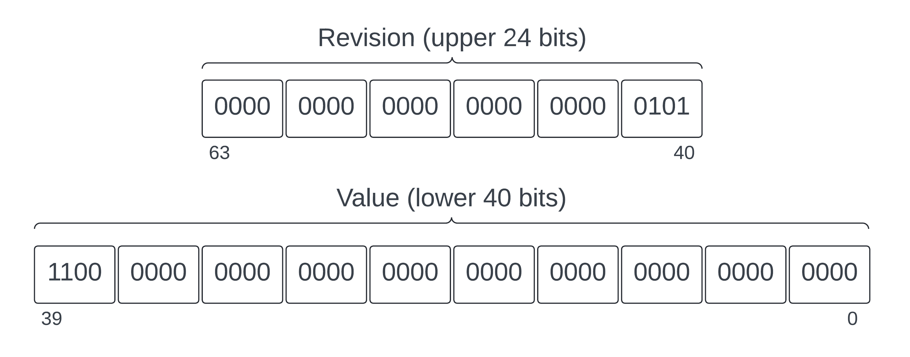

<pre>
  DIP: 0030
  Title: Replay Attack Prevention and State Transition Nonces
  Chain: Platform
  Author(s): Samuel Westrich
  Special-Thanks: Virgile Bartolo, Thephez
  Comments-Summary: No comments yet.
  Status: Proposed
  Type: Standard
  Created: 2024-04-17
  License: MIT License
</pre>

## Abstract

This proposal outlines the strategies employed by Dash Platform to prevent replay attacks: Partial Asset locks and Nonces. This document will describe how partial asset locks and the two nonce types - identity nonces and identity contract nonces - are used. Nonces play a crucial role in ensuring the uniqueness and sequential integrity of identity revisions, facilitating secure updates, and preventing replay attacks. Nonces also have a unique design in Dash that allows up to 24 operations per block per category of state transition. The presented validation scheme is designed to process nonce values efficiently, guaranteeing they adhere to system constraints regarding their sequence and proximity relative to previously accepted nonces.

## **Motivation**

Replay attacks are extremely harmful and must never be allowed to happen in a production environment. A replay attack is a generic network attack where a message is repeated or delayed, typically for malicious purposes. On Dash Platform a replay attack would consist of taking an existing state transition, sending it to Platform, and effectively executing it again. If this were to happen, multiple issues would arise: an attacker could drain a target’s balance or even change an element in the state back in time. To combat replay attacks, Platform uses two preventive measures depending on the type of state transition: asset lock fingerprinting and nonces.

Each identity state transition is associated with a nonce update to prevent old data from being reused maliciously. However, this introduces challenges in managing nonce values, especially in a distributed environment where updates may not always occur in a strictly sequential manner. Thus, a structured approach to nonce validation is necessary to maintain the integrity of identity revisions while allowing for practical flexibility in their sequencing.

## Related Work

* Asset lock DIP (in progress)
* Validation DIP (in progress)

## Partial Asset Locks

Asset locks represent a transfer of value from the Core chain to the Platform chain by using Identity Create and Identity TopUp state transitions. In an early iteration of Platform, Platform always spent the entire asset lock transaction value. If any issues were encountered during identity creation or top up, the system would either have to consume the entire asset lock amount or not use any of it. Both scenarios were problematic with the latter being a potential attack vector.

Partial asset locks solve both cases by enabling Platform to consume a portion of the asset lock value if there is an error during identity creation or top up. This solution removes the attack vector since Platform will be compensated for processing costs and users will retain their entire asset lock value (minus processing fees) if an error occurs. Any unused value in the asset lock remains available for future Create or TopUp state transitions.

### Asset Lock Fingerprinting

When Identity Create and TopUp state transactions transfer asset lock transaction value from the Dash Core chain to the Dash Platform chain, Platform uses the asset lock transaction's unique outpoint as a fingerprint. To prevent a double spend of asset lock inputs, Platform consensus logic relies on the uniqueness of the asset lock transaction’s outpoint as a fingerprint.

Then, to prevent replays of these state transitions, information is stored about state transitions that try to use an asset lock: if one of these state transitions succeeds, the asset lock outpoint’s fingerprint is marked as being fully used. Conversely, if one fails, a remaining balance is set under the asset locks outpoint’s fingerprint and the state transition signable bytes hash is added to a list of previously tried state transitions. Before executing a state transition that uses an asset lock, it is checked to see if the asset lock has been either partially or fully used and if the state transition signable bytes hash is present. If it were already present, this would indicate that a user is trying to replay the state transition. This is one of two mechanisms used to prevent replays, the other being nonces.

## Revision and Nonce Overview

In Dash Platform, identities and data contracts have both a revision and a nonce. Although these concepts are distinct, they both relate to providing security, data integrity, and orderly operation.

### Identity Revision

Each time an identity undergoes a modification through an Identity Update state transition, its revision number is incremented. The most common way for an identity to change is by adding a new key. The revision enables clients to easily verify that their known local identity public keys match their current ones on Platform. Instead of fetching all keys, a client only needs to fetch the revision. If the revision has changed, the client should fetch the identity key information; otherwise, it should do nothing.

### Data Contract Revision

Similar to the identity revision, the data contract revision tracks the updates made to a data contract within Dash Platform. Each alteration to the contract by a Data Contract Update state transition increments the contract's revision number. Clients can fetch the data contract revision to check for data contract updates. Additionally, clients can obtain each past contract version for contracts configured to store contract history.

### Nonces

Nonces are unique numbers included in state transitions to prevent replay attacks. These single-use values allow the system to identify previously processed state transitions and exclude them from being processed again. This process is necessary to maintain consistency in Platform state and protect identity funds from being exhausted through repeated broadcasts of their old state transitions.

### Comparison

Identity and data contract revisions serve similar purposes by tracking the versioning of identity and contract attributes (e.g., identity keys or contract documents). Nonces provide the uniqueness necessary to protect state transitions from replay attacks when updating contracts, working with documents, and completing certain identity operations. In contrast to revisions, which track infrequent changes and remain relatively static in most cases, nonces change based on the frequency of a particular identity or contract's usage. The combination of these mechanisms guarantees that all identity, data contract, and document updates happen safely and predictably.

## Identity Nonce and Identity Contract Nonce

Nonces play a crucial role in maintaining the security of identity and contract operations on Dash Platform. Since identities and contracts have different requirements, Platform uses two types of nonce: the identity nonce and the identity contract nonce. When an identity creates a state transition, it includes the relevant nonce. At a high level, the nonces are used as follows:

* The identity nonce is utilized for all identity state transitions that use a balance or create a data contract.
* The identity contract nonce is used for document and data contract update transitions.

While each nonce type serves distinct purposes and reflects the unique requirements of identity and document state transition execution, both guard against replay attacks by ensuring that each operation is uniquely identifiable and processed in the correct order. Without them, previous state transitions could be replayed.

### Identity Nonce

The identity nonce is primarily associated with state transitions that directly affect identities, such as identity withdrawal, transfer, and update. These operations involve changes to the identity itself, such as modifying identity attributes or managing balance.

Data contract creation also utilizes the identity nonce. This choice is made because a data contract, at the point of creation, has not yet been established within the system. Using the identity nonce for data contract creation avoids complications arising from attempts to reference a contract that does not yet exist or from operations that could potentially fail.

### Identity Contract Nonce

Identity contract nonces are designed to manage document state transitions, including document creation, replacement, and deletion. Documents represent the intersection between an identity and a data contract; they are instances of document types defined within a data contract and published by an identity. The identity contract nonce tracks the sequence of these document-related operations, ensuring their orderly and secure execution. The rationale for using the identity contract nonce for document state transitions originates from the fact that documents are linked to both an identity and a data contract. Consequently, document-related state transitions must account for both.

Data contract updates also employ the identity contract nonce. Since the data contract is already established in the system, any modifications to it directly impact the documents it governs; therefore, using the identity contract nonce is a logical choice.

### Nonce Value Specification

Nonces are stored as unsigned 64-bit integers. The 40 rightmost bits represent the nonce value of the newest transition in big-endian. The 24 leftmost bits, called the identity revision, represent a bitset of the last 24 transitions using this nonce. An identity revision bit is set to 1 if the nonce is missing, that is, if it was not included in a block, and to 0 if the nonce was present.

The following diagram shows a nonce with the identity revision bits (00...101) to indicate that the previous nonce and third-to-last nonce values are missing. The nonce value is (110...000)2 = (824633720832)10. Thus, the missing nonces are (824633720831)10 and (824633720829)10.

### Nonce Validation

Nonce validation ensures that state transition nonces are properly formatted and comply with the nonce value specification. If a nonce does not pass validation, the associated state transition is rejected and an error is returned.

#### Validation Constants

The following constants define the nonce validation constraints:

* **IDENTITY_NONCE_VALUE_FILTER**: 0xFFFFFFFFFF - This filter isolates the 40 bits that determine the nonce value. It extracts the sequence number from the nonce and discards the remaining bits.
* **MISSING_IDENTITY_REVISIONS_FILTER**: 0xFFFFFF0000000000 - This filter isolates the 24 bits of the nonce that signal skipped or missing revisions. It identifies gaps in the sequence of identity revisions, allowing for the detection of missing nonce values.
* **MAX_MISSING_IDENTITY_REVISIONS**: 24 - This constant establishes the maximum allowable number of missed revisions. If the difference between the current nonce and a proposed nonce exceeds this value, the new nonce is invalid. This is because the value is either too far ahead, indicating potentially lost or skipped revisions, or too far behind, suggesting an outdated revision attempt.
* **MISSING_IDENTITY_REVISIONS_MAX_BYTES**: 24 & **IDENTITY_NONCE_VALUE_FILTER_MAX_BYTES**: 40 - These constants define the byte sizes for tracking revisions and analyzing the nonce value, respectively. The former pertains to the maximum number of bytes dedicated to tracking missing revisions, while the latter specifies the byte size of the nonce sequence value.

#### Validation Outcomes

The validation process will result in one of the following possible outcomes depending on the validity of the nonce:

* **MergeIdentityNonceSuccess**: This is the only successful outcome. It signifies that the proposed nonce is within the range of valid values and that the merge (or update) can proceed successfully.
* **InvalidNonce**: Error indicating the nonce value is unacceptable, potentially because it is zero.
* **NonceTooFarInFuture**: Error occurring when the proposed nonce for a new revision is significantly higher than expected based on the current nonce. This indicates an attempt to insert a far-future revision.
* **NonceTooFarInPast**: Error indicating an attempt to insert a revision that is too far behind the current nonce value.
* **NonceAlreadyPresentAtTip**: Error indicating the proposed nonce matches the current nonce. This suggests a redundant or duplicate revision attempt.
* **NonceAlreadyPresentInPast**: Error indicating a potential replay attack since the proposed nonce matches a past nonce. This error returns an unsigned 64-bit integer indicating how far back the match occurs.

### Nonce Merging Process

In addition to validation, the overall nonce merging process includes additional steps to ensure accurate nonce progression. The complete set of steps consists of the following items:

1. **Initial Checks:** The process begins with preliminary validation. If the revision nonce is flagged by the MISSING_IDENTITY_REVISIONS_FILTER or is zero, it is invalidated immediately. These early checks prevent invalid nonce values from proceeding and ensure that only potentially valid nonces are considered for merging.
2. **Cost Estimation:** If the process is part of an estimation routine (where only the costs associated with nonce updates are calculated), the provided nonce is directly accepted as the nonce to set. This bypasses the need for further validation, as the operation only assesses the potential cost of modifying the state without actually changing it.
3. **Existing Nonce Comparison:** For actual nonce updates, the existing nonce (if present) is fetched and compared against the revision nonce. This comparison is central to the merging process, determining whether the new nonce is a valid sequential update, a redundant entry, or an outlier that's too far removed from the current sequence. Depending on the comparison result, several outcomes are possible:
    * **Equal:** If the existing and revision nonces match, the operation is redundant; the nonce is already present at the tip of the sequence.
    * **Less:** If the revision nonce is higher but within acceptable bounds, it indicates a valid update. The system calculates the gap in revisions and adjusts the missing revisions filter accordingly.
    * **Greater:** If the revision nonce is lower, it is either an attempt to fill in a missed revision or an invalid attempt to revert to a past state. The system checks against the missing revisions filter to decide.
4. **Finalizing the Nonce:** The actual nonce to set is determined based on the existing sequence and the validation performed. It might involve updating the missing revisions filter to account for newly discovered gaps or directly setting the revision nonce if no prior nonce exists.
5. **Updating Drive:** Finally, the determined nonce is encoded and inserted into Drive, ensuring the identity's nonce or contract nonce reflects the latest state transition. This update, represented as a low-level drive operation, finalizes the merging process.
